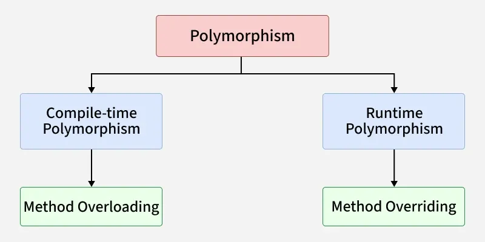
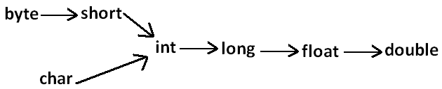
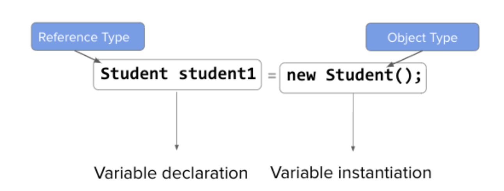
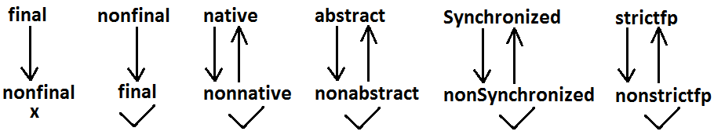
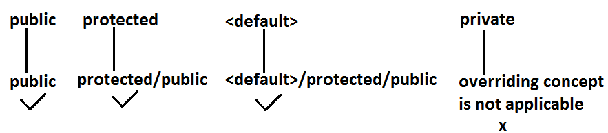

# OOPS
---

## Procedural vs OOPS
“Procedural programming focuses on functions and execution flow, while OOPS models real-world entities using objects, providing better security, reusability, and maintainability.”  
OOPS gives importance to data.

## Objects and classes
### Class (Class has properties and Behaviors)
A class is like a blueprint or design.  
👉 Car class = design of a car  
It defines what a car has and what a car can do  
Example (conceptually):  
Properties: color, speed, fuelType  
Behaviors: start(), accelerate(), brake()  
🧠 Think of it as the car design document.  

### Object
An object is a real instance created from the class.  
👉 If Car is the blueprint  
👉 BMW, Tata, VW are objects  
Example:  
Car car1 = Tata (Red, CNG)  
Car car2 = VW (White, Petrol)  
🧠 You can create many cars from the same blueprint.  

---

## Data hiding
- Our internal data should not go out directly. That is outside person can't access our internal data directly.
- By using private modifier we can implement data hiding.
- The main advantage of data hiding is security.
- Example:
```java
public class BankAccount {
    private double balance;
}
```

---

## Abstraction
- Hide internal implementation and just highlight the set of services, is called abstraction.
- By using **abstract classes and interfaces** we can implement abstraction.
```java
public interface PaymentService {
    void pay(double amount);
}
```
- User knows what pay() does, not how it’s implemented.

---

## Encapsulation
Encapsulation = bundling data + methods + controlling access  
In Java, encapsulation is achieved using:
- Classes
- Access modifiers (private, protected, public)
- Getter / setter methods

```java
public class BankAccount {
    private double balance;   // data hiding

    public void deposit(double amount) {
        balance += amount;
    }

    public double getBalance() {
        return balance;
    }
}
```

---

## Tightly encapsulated class
A class is said to be tightly encapsulated if **every data member of the class is private**, ensuring complete data hiding and controlled access.
```java
public class User {
    private String username;
    private String email;

    public User(String username, String email) {
        this.username = username;
        this.email = email;
    }

    public String getUsername() {
        return username;
    }

    public void updateEmail(String email) {
        this.email = email;
    }
}
```
### Notes:
- **Encapsulation depends only on instance variables, not methods.**
- Inheritance can break tight encapsulation
- If any parent class has a non-private variable, the child class is not tightly encapsulated.

--- 

## IS-A Relationship(inheritance) :
- By using "extends" and "implements" keywords we can implement IS-A relationship.
    - extends (class → class)
    - implements (class → interface)
### Is-A with Class inheritance
```java
public class Test {

    public static void main(String[] args) {
        Animal animal = new Animal();
        animal.eat();  // -> "Animal eats"

        Animal animalDog = new Dog();
        animalDog.eat();  // -> "Animal eats"
        animalDog.bark(); // -> ❌ method not available
        
        Dog dog = new Dog();
        dog.eat();  // -> "Animal eats"
        dog.bark(); // -> "Dog barks"

        Dog dogAnimal = new Animal();  // -> ❌ CE
    }

}

class Animal {
    void eat() {
        System.out.println("Animal eats");
    }
}

class Dog extends Animal {
    void bark() {
        System.out.println("Dog barks");
    }
}
```

### Is-A with Interface
```java
interface Vehicle {
    void move();
}

class Car implements Vehicle {
    public void move() {
        System.out.println("Car moves");
    }
}
```

### 🧠 How to identify Is-A relationship (interview trick)
Ask:
“Can I say X is a Y without sounding wrong?”
- Dog is an Animal ✅
- Car is a Vehicle ✅
- Employee is a Person ✅
- Engine is a Car ❌ (that’s Has-A) 

---

## Multiple inheritance
- Multiple inheritance means a class inherits from more than one parent class.
- In simple words:
```One child → multiple parents```

        A
       / \
      B   C
       \ /
        D

- ❌ Java does NOT support multiple inheritance with classes
```java
class A { }
class B { }

// ❌ Compile-time error
class C extends A, B { }
```

### The Diamond Problem
1. Diamond Problem with Classes
        A
       / \
      B   C
       \ /
        D
```java
class A {
    void show() {
        System.out.println("A");
    }
}

class B extends A { }
class C extends A { }

// If Java allowed this
class D extends B, C { }
```
D gets show() from both paths (B → A and C → A)  
Ambiguity ❌: which path to follow?  

2. Diamond Problem with Interfaces (Java 8+)
```java
interface A {
    default void show() {
        System.out.println("A");
    }
}

interface B {
    default void show() {
        System.out.println("B");
    }
}

class C implements A, B {
    public void show() {
        A.super.show(); // explicit resolution
    }
}
```
Java forces you to:
- Override
- Resolve ambiguity explicitly

### Multiple inheritance via interfaces
```java
interface Flyable {
    void fly();
}

interface Swimmable {
    void swim();
}

class Duck implements Flyable, Swimmable {
    public void fly() {
        System.out.println("Duck flies");
    }

    public void swim() {
        System.out.println("Duck swims");
    }
}
```


--- 

## HAS-A relationship
- Has-A relationship means: One class contains or uses another class.
- Instead of inheritance, the relationship is built using object references.
- In Java, Has-A is implemented using:
    - Composition
    - Aggregation

### Composition (Strong Has-A)
- In composition, the contained object’s lifecycle is tied to the owner.
- If the parent is destroyed → child is destroyed.
```java
class Engine {
    void start() {
        System.out.println("Engine started");
    }
}

class Car {
    private Engine engine = new Engine(); // composition

    void drive() {
        engine.start();
        System.out.println("Car is moving");
    }
}
```

### Aggregation (Weak Has-A)
- In aggregation, the contained object exists independently and can be shared.
- Parent gone → child still exists.
```java
class Address {
    String city;
}

class Employee {
    private Address address; // aggregation

    Employee(Address address) {
        this.address = address;
    }
}
```

---

## Method signature:
- **method signature = (method name + parameter list)**
- ✅ Method signature does NOT include:
    - Return type ❌
    - Access modifiers ❌
    - Method body ❌
    - throws clause ❌

```java
public int add(int a, int b) {
    return a + b;
}
```
- Method signature - ```add(int, int)```
- ❌ Return type alone cannot change signature
```java
int sum(int a, int b) { }
double sum(int a, int b) { } // ❌ compile-time error
```

**Note: Method Declaration = Signature + return type + modifiers + throws**

---

## Polymorphism:
One interface / method behaves differently based on object type


### 1️⃣ Compile-time Polymorphism (Overloading)
- Same method name, different parameters
- Resolved at compile time based on method signature.
```java
class Test {
    public void methodOne() {
        System.out.println("no-arg method");
    }
    public void methodOne(int i) {
        System.out.println("int-arg method"); //overloaded methods
    }
    public void methodOne(double d) {
        System.out.println("double-arg method");
    }
    public static void main(String[] args) {
        Test t=new Test();
        t.methodOne();      //no-arg method
        t.methodOne(10);    //int-arg method
        t.methodOne(10.5);  //double-arg method
    }
}
```
In overloading compiler is responsible to perform method resolution(decision) based on the reference type(but not based on run time object). Hence overloading is also considered as compile time polymorphism/static polymorphism/early biding.

#### Case 1 : Automatic promotion in overloading.
- In overloading if compiler is unable to find the method with exact match we won't get any compile time error immediately.
- 1st compiler promotes the argument to the next level and checks whether the matched method is available or not if it is available then that method will be considered if it is not available then compiler promotes the argument once again to the next level. 
- This process will be continued until all possible promotions still if the matched method is not available then we will get compile time error. 
- This process is called automatic promotion in overloading.


```java
public class Test {
    public void methodOne(int i) {
        System.out.println("int-arg method");
    }

    public void methodOne(float f) { //overloaded methods
        System.out.println("float-arg method");
    }

    public static void main(String[] args) {
        Test t = new Test();
        t.methodOne('a');//int-arg method
        t.methodOne(10L);//float-arg method
        t.methodOne(10.5);//C.E:cannot find symbol
    }
}
```

#### Case 2:
- While resolving overloaded methods exact match will always get high priority.
- While resolving overloaded methods child class will get the more priority than parent.
- In general var-arg method will get less priority that is if no other method matched then only var-arg method will get chance for execution, it is almost same as default case inside switch.
```java
public class Test {
    public void methodOne(String s) {
        System.out.println("String version");
    }

    public void methodOne(Object o){ //Both methods are said to be overloaded methods.
        System.out.println("Object version");
    }

    public static void main(String[] args) {
        Test t = new Test();
        t.methodOne("arun");        //String version
        t.methodOne(new Object());      //Object version
        t.methodOne(null);          //String version
    }
}
```


#### Case 3:
In overloading method resolution is always based on reference type and runtime object won't play any role in overloading.

```java
class Animal {
}

class Monkey extends Animal {
}

class Test {
    public void methodOne(Animal a) {
        System.out.println("Animal version");
    }

    public void methodOne(Monkey m) {
        System.out.println("Monkey version");
    }

    public static void main(String[] args) {
        Test t = new Test();
        Animal a = new Animal();
        t.methodOne(a);     //Animal version
        Monkey m = new Monkey();
        t.methodOne(m);     //Monkey version
        Animal a1 = new Monkey();
        t.methodOne(a1);    //Animal version
    }
}
```

--- 

## 2️⃣ Runtime Polymorphism (Overriding)
1. Whatever the Parent has by default available to the Child through inheritance, if the Child is not satisfied with Parent class method implementation, then Child is allow to redefine that Parent class method in Child class in its own way. This process is called overriding.
2. The Parent class method which is overridden is called overridden method.
3. The Child class method which is overriding is called overriding method.

```java
class Parent {
    public void property() {
        System.out.println("cash+land+gold");
    }

    //overridden method
    public void marry() {
        System.out.println("subbalakshmi"); 
    }
}

class Child extends Parent {
    //overriding method
    @Override
    public void marry() {
        System.out.println("Anushka");
    }
}

class Test {
    public static void main(String[] args) {
        Parent p = new Parent();
        p.marry();          //subbalakshmi(parent method)
        Child c = new Child();
        c.marry();          //Anushka(child method)
        Parent p1 = new Child();
        p1.marry();         //Anushka(child method)
    }
}
```
- In overriding method resolution is always takes care by JVM based on runtime object. Hence overriding is also considered as runtime polymorphism or dynamic polymorphism or late binding.
- In overriding runtime object will play the role and reference type is dummy.

### Rules for overriding :
- In overriding method names and arguments must be same. That is method signature must be same.
- Until 1.4 version the return types must be same but from 1.5 version onwards covariant return types are allowed.
- According to this Child class method return type need not be same as Parent class method return type, its Child types also allowed. **Co-variant return type** concept is applicable only for object types but not for primitives.
- Private methods are not visible in the Child classes hence overriding concept is not applicable for private methods. Based on our requirement we can declare the same Parent class private method in child class also. It is valid but not overriding.
- Parent class final methods we can't override in the Child class.
- Parent class non final methods we can override as final in child class. We can override native methods in the child classes.
- We should override Parent class abstract methods in Child classes to provide implementation.
- We can override a non-abstract method as abstract this approach is helpful to stop availability of Parent method implementation to the next level child classes.
```java
class Parent {
    public void methodOne() { }
    }
abstract class Child extends Parent {
    public abstract void methodOne();
    }
```

- While overriding we can't reduce the scope of access modifier.
```java
class Parent {
    public void methodOne() { }
}
class Child extends Parent {
    protected void methodOne( ) { }
}
```
Output:
```text
Compile time error :
methodOne() in Child cannot override methodOne() in Parent;
attempting to assign weaker access privileges; was public
```
  

```private < default < protected < public```
- While overriding if the child class method throws any checked exception, compulsory the parent class method should throw the same checked exception or its parent otherwise we will get compile time error. But there are no restrictions for un-checked exceptions.
- We can't override a static method as non static. Similarly we can't override a non static method as static.
- Overriding concept is not applicable for variables. Variable resolution is always takes care by compiler based on reference type.

---

### METHOD HIDING :
```java
class Parent{
    public static void methodOne() {}
}
class Child extends Parent {
    public static void methodOne() {}
}
```
It is valid. It seems to be overriding concept is applicable for static methods but it is not overriding it is method hiding.
