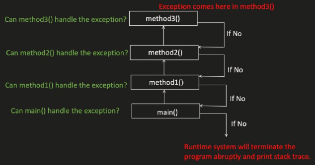
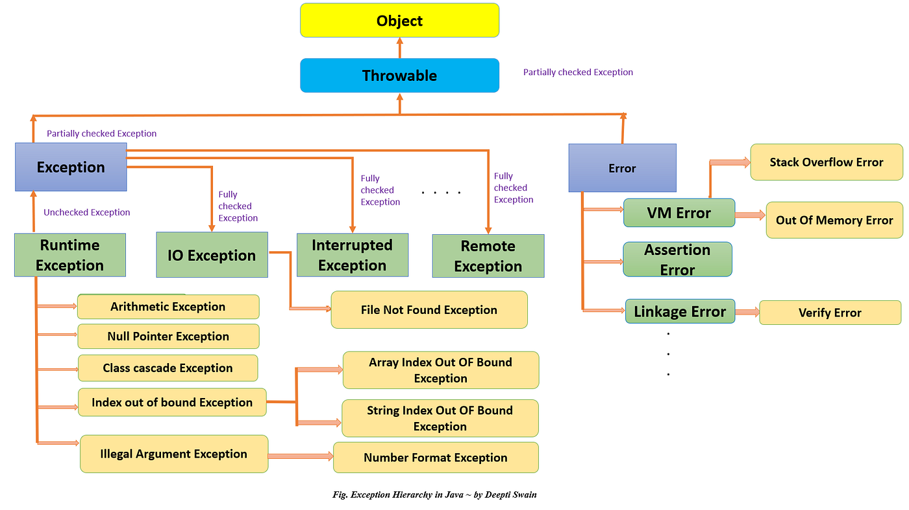

# Exception Handling
---

## What is exception?
Exception is an event that occurs during program execution and disrupts the normal flow of the program. When an exception occurs, Java creates an exception object and the program stops normal execution unless the exception is handled.  


```java
public class Main {
    public static void main(String[] args) {
        int result = method1();
    }

    private static int method1() {
        return method2();
    }

    private static int method2() {
        return method3();
    }

    private static int method3() {
        return 5/0;
    }
}
```
Output:  
```txt
Exception in thread "main" java.lang.ArithmeticException: / by zero
	at test.exception.Main.method3(Main.java:17)
	at test.exception.Main.method2(Main.java:13)
	at test.exception.Main.method1(Main.java:9)
	at test.exception.Main.main(Main.java:5)
```
---

## Exception hierarchy

---
## Un-checked/Runtime Exception
Occurs at runtime and compiler does not force to handle them.

1. `ClassCastException`
```java
public static void main(String[] args) {
    Object val =0;
    System.out.println((String) val);
}
```    
Output:
```txt
Exception in thread "main" java.lang.ClassCastException: class java.lang.Integer cannot be cast to class java.lang.String (java.lang.Integer and java.lang.String are in module java.base of loader 'bootstrap')
	at test.exception.Main.main(Main.java:6)
```

2. `ArithmeticException`
```java
    public static void main(String[] args) {
        int result = 10 / 0;
    }
```
Output:
```txt
Exception in thread "main" java.lang.ArithmeticException: / by zero
	at test.exception.Main.main(Main.java:5)
```

3. `IndexOutOfBoundsException`
```java
    public static void main(String[] args) {
        int[] arr = {1, 2, 3};
        System.out.println(arr[10]);
    }
```
Output:
```txt
Exception in thread "main" java.lang.ArrayIndexOutOfBoundsException: Index 10 out of bounds for length 3
	at test.exception.Main.main(Main.java:6)
```

4. `NullPointerException`
```java
    public static void main(String[] args) {
        List<Integer> list = new ArrayList<>();
        list.add(null);
        System.out.println(list.get(0).equals(10));
    }
```
Output:
```txt
Exception in thread "main" java.lang.NullPointerException: Cannot invoke "java.lang.Integer.equals(Object)" because the return value of "java.util.List.get(int)" is null
	at test.exception.Main.main(Main.java:10)
```

5. `IllegalArgumentException`
```java
    public static void main(String[] args) {
        String val = "abc";
        Integer x = Integer.valueOf(val);
    }
```
Output:
```txt
Exception in thread "main" java.lang.NumberFormatException: For input string: "abc"
	at java.base/java.lang.NumberFormatException.forInputString(NumberFormatException.java:67)
	at java.base/java.lang.Integer.parseInt(Integer.java:668)
	at java.base/java.lang.Integer.valueOf(Integer.java:999)
	at test.exception.Main.main(Main.java:9)
```
---
## Checked/Compile time exception
Compiler verifies it during the compile time of the code and if not handled properly, we will get CE.
```java
public class Main {
    public static void main(String[] args) {
        method1();
    }

    private static void method1() {
        FileReader file = new FileReader("test.txt"); // ❌ CE: Unhandled exception: java.io.FileNotFoundException
    }
}
```
---

## How to handle exceptions?

### try-catch
- `try` block specify the code which can throw exception.
- `try` block followed either by `catch` or `finally` block.
- `catch` block is used to catch all the exceptions thrown in `try` block.
- Multiple `catch` blocks can be used.
```java
public class Main {
    public static void main(String[] args) {
        try {
            method1("dummy");
        } catch (ClassNotFoundException | InterruptedException e) {
            throw new RuntimeException(e);
        }
    }

    private static void method1(String name) throws ClassNotFoundException, InterruptedException {
        if(name.equals("dummy")) {
            throw new ClassNotFoundException("Class not found for name: " + name);
        } else if(name.equals("wait")) {
            throw new InterruptedException("Thread was interrupted while waiting");
        } else {
            System.out.println("Name is valid: " + name);
        }
    }
}
```
#### Below combinations are invalid -
```java
    public static void main(String[] args) {
        try {
            method1("dummy");
        } catch (ClassNotFoundException | InterruptedException e) {
            throw new RuntimeException(e);
        } catch (FileNotFoundException e){ // ❌ CE: Exception 'java.io.FileNotFoundException' is never thrown in the corresponding try block
            System.out.println("File not found: " + e.getMessage());
        }
    }
```

```java
    public static void main(String[] args) {
        try {
            method1("dummy");
        } catch (Exception e){
            System.out.println("Caught exception: " + e.getMessage());
        } catch (ClassNotFoundException | InterruptedException e) {  // ❌ CE: Exception 'java.lang.InterruptedException' has already been caught
            throw new RuntimeException(e);
        }
    }
```
But this is valid:
```java
    public static void main(String[] args) {
        try {
            method1("dummy");
        } catch (ClassNotFoundException |
                 InterruptedException e) {
            throw new RuntimeException(e);
        } catch (Exception e) {
            System.out.println("Caught exception: " + e.getMessage());
        }
    }
```
---

### try-catch-finally or try-finally
- `finally` block is used after `catch` block or `try` block.
- `finally` block will always get executed, even if we `return` from `try` or `catch`.
- At most, we can have only one `finally` block.
- Mostly used for closing the db connection objects or adding logs etc.
- `finally` block will be skipped in below scenarios 
    - JVM related issues like OOM, system shut down etc.
    - Process is forcefully killed (`System.exit(0);`)
```java
    public static void main(String[] args) {
        try {
            method1("dummy");
        } catch (ClassNotFoundException |
                 InterruptedException e) {
            throw new RuntimeException(e);
        } catch (Exception e) {
            System.out.println("Caught exception: " + e.getMessage());
        } finally {
            System.out.println("This block always executes");
        }
    }
```
or
```java
    public static void main(String[] args) {
        try {
            method1("dummy");
        } finally {
            System.out.println("This block always executes");
        }
    }
```

--- 

### `throw`
- It is used to throw a new Exception or re-throw the exception.
- The exception is thrown immediately
- Execution stops unless it is caught
```java
    public static void main(String[] args) throws ClassNotFoundException, InterruptedException {
        try {
            method1("dummy");
        } catch (ClassNotFoundException |
                 InterruptedException e) {
            throw new RuntimeException(e);  // Wrapping checked exceptions in an unchecked exception
        } catch (Exception e) {
            System.out.println("Caught exception: " + e.getMessage());
        } finally {
            System.out.println("This block always executes");
        }
    }
```

### `throws`
- It is used in method declaration to indicate that the method might throw exceptions.
- The responsibility of handling the exception is passed to the caller
```java
class Test {

    static void readFile() throws IOException {
        FileReader file = new FileReader("test.txt");
    }

    public static void main(String[] args) throws IOException {
        readFile();
    }
}
```

---

## Custom/User-defined exceptions
```java
public class ApiException extends Exception {
    private int statusCode;

    public ApiException(String message, int statusCode) {
        super(message);
        this.statusCode = statusCode;
    }

    public int getStatusCode() {
        return statusCode;
    }
}
```

```java
public class Main {
    public static void main(String[] args) {
        try {
            method1("dummy");
        } catch (ApiException e){
            System.out.println("Caught ApiException: " + e.getMessage() + " with status code: " + e.getStatusCode());
        }
        finally {
            System.out.println("This block always executes");
        }
    }

    private static void method1(String name) throws ApiException {
        throw new ApiException("API error occurred", 500);
    }
}
```
---

## At last, Why do we handle exceptions?
- Prevent program crashes
- Maintain normal program flow
- Handle runtime errors gracefully
- Provide meaningful error messages to users
- Ensure proper resource management (files, DB connections, etc.)
- Improve application stability and reliability
- Help in debugging using stack traces and logs
- Allow recovery from unexpected situations
- Maintain data consistency in applications