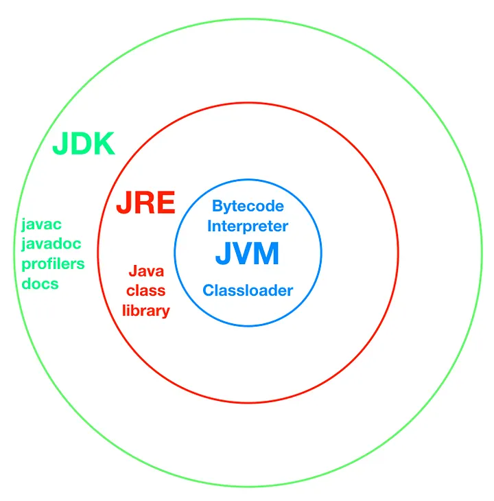
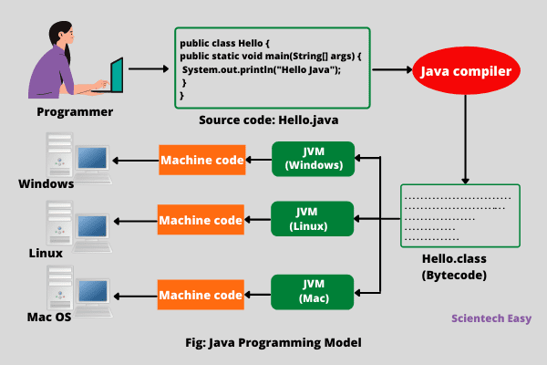

# JVM_JRE_JDK
---

## What is Java?
- Platform independent language
- Supports OOPS
- Portable (WORA - Write Once Run Anywhere)

### 3 main components :


#### JVM (Java Virtual Machine)
It's just an abstract machine that doesn't exist physically.



#### Note:
- **JVM is platform dependent**
- We need to install JVM based on the platform i.e. MacOS, Linux or windows. Input for JVM is bytecode & output is machine code. Now since bytecode can run by any JVM, it makes a Java program **platform independent**.
- JVM has JIT (Just In Time) compiler which takes bytecode & convert it into machine code.

---

#### JRE : Java Runtime Environment
- JRE Contains JVM & class libraries i.e. the libraries which we've used in the code.
- So if we have JRE, **we can run any Java Program but we cannot code the program**.

---

#### JDK : Java Development Kit
- It has programs language information
- It has compiler (javac)
- It has debugger

So `JDK = JRE + (Program Language + compiler + debugger + other dev components)`

**Note: So JVM, JRE and JDK all three are platform dependent but the Compiled bytecode is platform independent.**

---

#### JIT : Just-In-Time compiler
JIT (Just-In-Time) Compiler is a part of the JVM that converts bytecode into native machine code at runtime to improve performance.

**⚙️ How JIT Works (Step-by-step)**  
1️⃣ You compile Java code `javac MyClass.java`   
→ Generates bytecode

2️⃣ JVM starts running the program  
→ Uses Interpreter initially

3️⃣ JVM monitors which methods run frequently  
→ These are called Hot Spots

4️⃣ JIT compiles hot methods into native machine code  

5️⃣ Next time method runs  
→ Directly executes native code  
→ ⚡ Much faster  

🧪 Example
```java
for(int i = 0; i < 1_000_000; i++) {
    sum += calculate();
}
```
If calculate() is called many times:
- JVM marks it as “hot”
- JIT compiles it to machine code
- Future calls are super fast

--- 

## What is ClassLoader in Java?
- ClassLoader is a JVM component responsible for loading .class files into memory at runtime.
- It loads classes only when needed (lazy loading) — not all at once.
- Java follows a parent delegation model
```text
Bootstrap ClassLoader
        ↑
Extension ClassLoader
        ↑
Application ClassLoader
```

1. Bootstrap ClassLoader
- Loads core Java classes
- Examples:
    - java.lang.*
    - java.util.*
- Written in native code (C/C++)
- Highest priority

2. Extension ClassLoader
- Loads classes from:
`$JAVA_HOME/lib/ext`
- Used for extension libraries

3. Application ClassLoader (System ClassLoader)
- Loads your application classes
- Reads from: `classpath`

 ### Parent Delegation Model
- Whenever a class is requested: It does NOT load directly
- Instead:
    - Check if class is already loaded
    - Delegate request to parent
    - Parent tries to load
    - If parent can't → child loads it
- Flow Example
```java
Class.forName("java.lang.String");
```
Steps:
1. Application ClassLoader gets request
2. Delegates to Extension
3. Delegates to Bootstrap
4. Bootstrap finds and loads String

### Class Loading Phases (Deep Dive)
After ClassLoader loads a class, JVM performs:
1. Loading
- Reads .class file
- Converts into binary
- Stores in memory

2. Linking  
- Verification  
    - Bytecode correctness check
    - Prevents malicious code  
- Preparation  
    - Allocates memory for static variables
    - Default values assigned  
- Resolution  
    - Replaces symbolic references with actual memory references

3. Initialization
- Executes:
    - Static blocks
    - Static variable assignments

**When is class initialized?**
- Static variable access
- Static block execution
- Reflection (`Class.forName()`)


