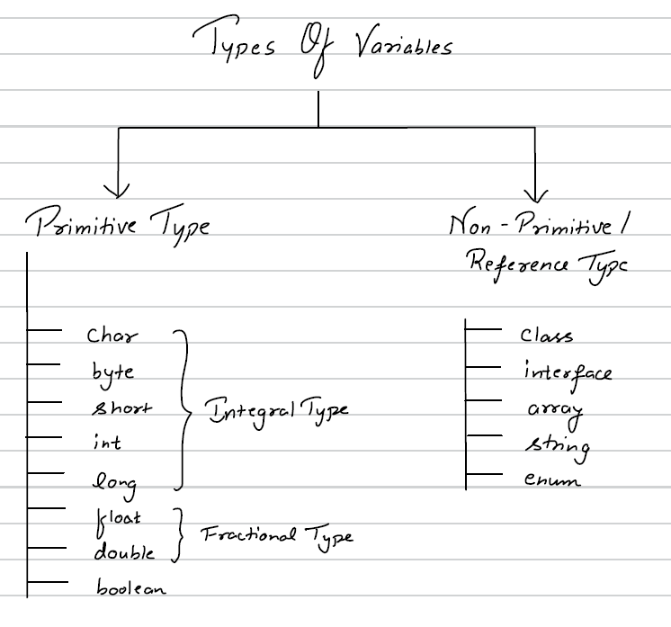
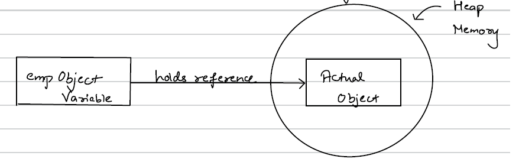
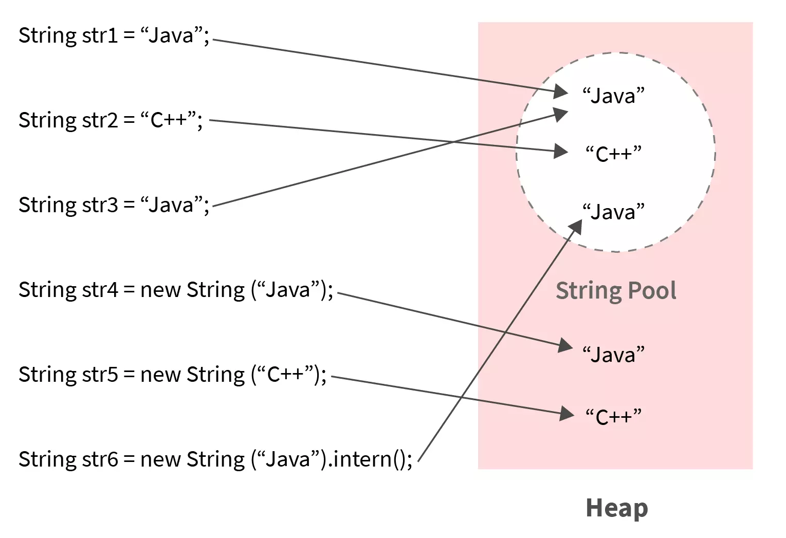

# Java Variables
---
## What is a variable ?
- It is a container which holds a value
- How to declare ?  
`Datatype Variable_Name = value;`  
Eg : int         i        =  1;  
    boolean    bool       = True ;  
---
- Java is **Static typed language** i.e. we mandatorily have do define the datatype of a variable.
- Java is a **Strongly Typed Language** i.e there is a restriction on what value can be assigned to a variable.

---
## Types of variables


---

## Java Primitive Data Types
| Type     | Size (bits) | Range                                                                 | Default Value |
|----------|------------|------------------------------------------------------------------------|--------------|
| byte     | 8          | -128 to 127                                                            | 0            |
| short    | 16         | -32,768 to 32,767                                                      | 0            |
| int      | 32         | -2^31 to 2^31 - 1  (-2,147,483,648 to 2,147,483,647)                | 0            |
| long     | 64         | -2^63 to 2^63 - 1                                                      | 0L           |
| float    | 32         | ±1.4E-45 to ±3.4028235E38                                             | 0.0f         |
| double   | 64         | ±4.9E-324 to ±1.7976931348623157E308                                  | 0.0d         |
| char     | 16         | 0 to 65,535 (Unicode characters)                                      | '\u0000'     |
| boolean  | JVM dependent (typically 1 bit internally) | true / false                          | false        |

### Important Points
- Default values apply only to instance variables, not local variables.
- `char` stores Unicode characters (0 to 65535).
- `boolean` size is not precisely defined by JVM spec.
- `float` requires `f` suffix.
- `long` requires `L` suffix if value exceeds int range.

---

## 2's Complement in Java
Two’s complement is a method to represent negative numbers in binary.

### Steps to Find 2’s Complement
1. Convert number to binary
2. Invert all bits (1’s complement)
3. Add 1

### Example: Represent -5 (8-bit)

5 = 00000101

1’s complement:
11111010

Add 1:
11111011

So, -5 = 11111011

### Key Points
- MSB (Most Significant Bit) represents sign (0 = positive, 1 = negative)
- int range = -2^31 to 2^31 - 1
- Only one representation of zero


--- 

## Types of Type Conversion in Java


### 1. Widening (Implicit Conversion)
Smaller → Larger data type.
Done automatically. No data loss.

Example:
```java
int a = 10;
double b = a;   // int → double (automatic)
System.out.println(b);  // 10.0
```

Flow:
byte → short → int → long → float → double

---

### 2. Narrowing (Explicit Conversion)
Larger → Smaller data type.
Manual casting required. May cause data loss.

Syntax:  
`(target_type) value`

Example:
```java
double x = 10.75;
int y = (int) x;
System.out.println(y);  // 10 => Decimal part is lost.
```

---

### 3. Type Promotion in Expressions
Java automatically promotes smaller types:
```byte, short, char → int```

Example:
```java
byte a = 10;
byte b = 20;
int c = a + b;  // result is int
```

### 🧠 Important Rules  
✔ boolean cannot be converted to any other type  
✔ Cannot convert object types like primitives  
✔ Arithmetic operations auto-promote to int  

---

## Kinds of Variables in Java

### 1️⃣ Instance (Member) Variables
- Declared inside a class but outside methods
- Each object gets its own copy
```java
class Student {
    String name;   // instance variable
    int age;       // instance variable
}
```

```java
Student s1 = new Student();
Student s2 = new Student();
```
Memory:
- s1.name → separate
- s2.name → separate

🧠 Key Points  
✔ Stored in Heap memory  
✔ Created when object is created  
✔ Destroyed when object is destroyed  
✔ Gets default values  
✔ Accessed using object reference  


### 2️⃣ Static Variables (Class Variables)
- Declared using static keyword
- Only ONE copy shared among all objects
```java
class Student {
    static String schoolName = "ABC School";
}
```
```java
Student.schoolName = "XYZ School";  // static variable can be accessed and modified without creating an instance of the class
```
Memory:
- Only one copy
- Shared by all objects

🧠 Key Points  
✔ Stored in **Method Area (Metaspace in modern JVM)**  
✔ Created when class is loaded  
✔ Shared among all objects  
✔ Gets default values  
✔ Access using: ClassName.variable  


### 3️⃣ Local Variables
- Declared inside a method, constructor, or block
```java
class Test {
    void display() {
        int x = 10;   // local variable
    }
}
```

🧠 Key Points  
✔ Stored in Stack memory  
✔ Created when method is called  
✔ Destroyed when method ends  
✔ ❌ No default value (must initialize)  
✔ Cannot use access modifiers  

---

## Pass by Value vs Pass by Reference in Java
🚨 Important Truth
- Java is 100% Pass by Value.
- There is NO pass by reference in Java.

🧠 What Does “Pass by Value” Mean?
- When a method is called, A copy of the variable is passed
- Changes inside method don't affect original variable (for primitives)

1️⃣ Primitive Types 
```java
class Test {
    static void change(int x) {
        x = 100;
    }

    public static void main(String[] args) {
        int a = 10;
        change(a);
        System.out.println(a);   // prints 10
    }
}
```
Why?
- a is copied into x
- Changing x doesn’t change a


2️⃣ Objects (Where Confusion Happens)
```java
class Student {
    String name;
}

class Test {
    static void change(Student s) {
        s.name = "Rahul";
    }

    public static void main(String[] args) {
        Student st = new Student();
        st.name = "Abhi";

        change(st);
        System.out.println(st.name);    // Prints Rahul
    }
}
```

**Why Did It Change?**
Because:
- `st` stores a reference
- That reference is copied
- Both references point to the same object
- Modifying object affects original  
👉 But reference itself is still passed by value.

---

## Reference Data Types (Non-Primitive Date Types)
There are mainly 4 type of renference data types :
- Class
- String
- Interface
- Array

---

### What is reference ?
Let's understand with an example of class
So Let's create a class -
```java
public class Employee {
    private int id;

    public int getId() {
        return id;
    }

    public void setId(int id) {
        this.id = id;
    }
}
```

Now to create an object of class Employee
```java
public class Main {
    public static void main(String[] args) {
        Employee employee = new Employee();
    }
}
```
New keyword allocates a memory block object and the variable's name holds a reference to actual memory.


---

### String Reference Data Type in Java
🧠 What is String?  
```java
String s = "Hello";
```
Here:  
String → Class (from java.lang)  
s → Reference variable  
"Hello" → Object  


🔥 Where Strings Are Stored?  
1️⃣ String Literal (Stored in String Pool)  
```java
String s1 = "Java";
String s2 = "Java";
```
✔ Only ONE object created in String pool.  
✔ Both references point to same object.    




2️⃣ Using new Keyword (Stored in Heap)
```java
String s3 = new String("Java");
```
✔ Creates a NEW object  
✔ Does not reuse pool object  


🧪 Comparison Example
```java
String s1 = "Java";
String s2 = "Java";
String s3 = new String("Java");

System.out.println(s1 == s2);      // true
System.out.println(s1 == s3);      // false
System.out.println(s1.equals(s3); // true
```


🧠 Important: String is Immutable
```java
String s = "Java";
s.concat(" Backend");
System.out.println(s);      // Java
s = s.concat(" Backend");
System.out.println(s);      // Java Backend
```

Why?
- Strings cannot be modified  
- concat() creates new object  
- Original remains unchanged  

🧠 equals() vs ==
```java
String a = "Java";
String b = new String("Java");

a == b        // false
a.equals(b)   // true
```

- == → reference comparison
- equals() → content comparison


🧩 Internal Structure (Simplified)
```java
public final class String {
    private final byte[] value;
}
```

✔ final class  
✔ internal array is final  
✔ immutable design  


---

## Interface Reference Data Type in Java
An interface can be used as a reference type to refer to an object of a class that implements it.

🧠 Basic Idea
```java
interface Animal {
    void sound();
}

class Dog implements Animal {
    public void sound() {
        System.out.println("Dog barks");
    }
}
```

Now
```java
Animal a = new Dog();
a.sound();  // Dog barks
```

Here:
- Animal → Interface (reference type)
- a → Interface reference variable
- new Dog() → Object
- Dog implements Animal


📌 Important Rules  
1️⃣ Interface cannot be instantiated  
2️⃣ Interface reference can only access Methods declared in interface  
```java
Animal a = new Dog();
a.sound();  // OK

a.run();    // ❌ if run() not in Animal
```

🧠 Very Important Concept
- **Reference type determines what methods are accessible.**
- **Object type determines which method implementation runs.**


---

## Array as Reference Data Type in Java
- Array is a reference data type.
- Array is an object stored in heap memory.
- Reference variable is stored in stack.
- Arrays are mutable.
- Arrays have fixed size.

```java
int[] arr = new int[3];
```

--- 

## Class as Reference Data Type in Java

- A class is a blueprint for creating objects.
- Objects are stored in heap memory.
- Reference variable stores address of object.
- Multiple references can point to same object.

Example:
```java
Student s1 = new Student();
```

Memory:
s1 → Student object in heap


--- 

## Wrapper Classes
- Wrapper classes are object representations of primitive data types.
- Primitive → Wrapper Mapping

| Primitive Type | Wrapper Class | Size (bits) | Default Value (Primitive) | Default Value (Wrapper) |
|---------------|--------------|-------------|---------------------------|--------------------------|
| byte          | Byte         | 8           | 0                         | null                     |
| short         | Short        | 16          | 0                         | null                     |
| int           | Integer      | 32          | 0                         | null                     |
| long          | Long         | 64          | 0L                        | null                     |
| float         | Float        | 32          | 0.0f                      | null                     |
| double        | Double       | 64          | 0.0d                      | null                     |
| char          | Character    | 16          | '\u0000'                  | null                     |
| boolean       | Boolean      | 1*          | false                     | null                     |


- All wrapper classes are in: ```java.lang package```
- **Wrapper Objects Are Immutable**


📌 Why Do We Need Wrapper Classes?  
Primitives are:
- Not objects
- Cannot be used in Collections
- Cannot call methods
- Cannot be null. But many Java features require objects.


📌 What is Boxing?  
🔹 Manual Boxing (Before Java 5)
Converting primitive → wrapper manually:
```java
int a = 10;
Integer obj = new Integer(a);  // old way (deprecated)
```
Better way:
```java
Integer obj = Integer.valueOf(a);
```


📌 What is Autoboxing?  
Automatic conversion of primitive → wrapper
```java
int a = 10;
Integer obj = a;   // Autoboxing
```

Compiler converts it to:
```java
Integer obj = Integer.valueOf(a);
```

📌 What is Unboxing?  
Automatic conversion of wrapper → primitive
```java
Integer obj = 20;
int a = obj;   // Unboxing
```
Compiler converts it to:
```java
int a = obj.intValue();
```

🧠 Real Example (Collections)  
```java
ArrayList<Integer> list = new ArrayList<>();

list.add(10);  // autoboxing
int x = list.get(0);  // unboxing
```


### Integer Caching (Very Important Interview Question)
```java
Integer a = 100;
Integer b = 100;

System.out.println(a == b);  // true (though the reference is different)
```
Why?
Because Java caches values from: -128 to 127

But:
```java
Integer a = 200;
Integer b = 200;

System.out.println(a == b);  // false
```
Because outside cache range.

---

## Constant Variable
- We cannot change the value of a constant variable. This is usually created using final keyword.
```java
Static final VAR = 10;
```
static => It means only one copy exists.  
final => It means value of var can't be changed.  
