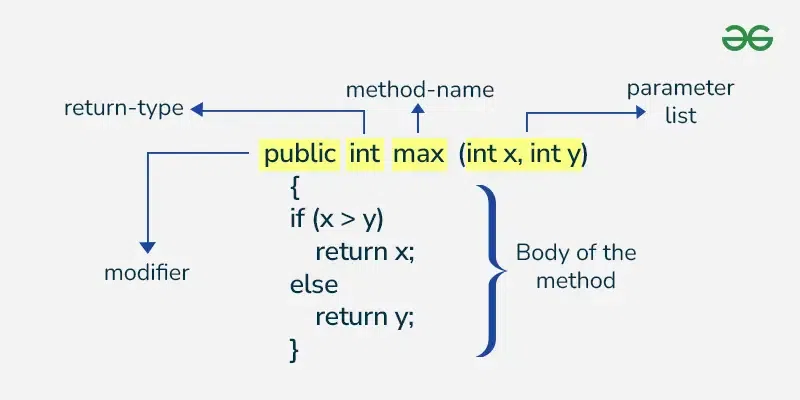

# Methods and Constructors
---

# Methods 
---

## What is method?
- Method is used to perform a certain task  
- Collection of instructions that performs a specific task  
- It can be used to bring the code readability and reusability  
For eg : -
```java
public class Main {
    public static void main(String[] args) {
        int price = 10;
        int gst = 2;
        int totalPrice = sum(price,gst);
        System.out.println("Total price including GSt : " + totalPrice);
    }
    
    public static int sum(int val1, int val2){
        int total = val1 + val2;
        System.out.println("Addition of given numbers is : " + total);
        return total;
    }
}
```
Here Sum is a method which will take 2 arguments and return the addition of both the numbers. Since we reused the code of method to perform add so it provides reusability.  

## How to declare method?
  

## Access Specifiers  
- Defines accessibility of a method i.e who can use the method  
- There are 4 types of access specifiers in Java methods:-  
1) Public: can be accessed through any class in any package.    
2) Private: can be accessed by methods only in the same class  
3) Protected: can be accessed by other classes in same package or other sub classes in different package.  
4) Default : It can only be accessed by classes in same package.  

Note: **If we do not mention anything, then Default access specifier is used by Java.**

## Return Type
- It tells what type the method will return after computatio. If the method don't return anything , **void** return type is used.  
- Use class name or primitive data types as return type of the method.  

## Method Name
- It should be verb (or some kind of action)  
- Should start with small letter and follow camel case in case of multiple words (eg. getTotalPrice())  

## Method Parameters
- It's a list of variables that will be used in the method.
- Parameter list can be blank too. (no-args method)

## Method Body :
- Method body get finished when you call ``return`` in mid.
- Gets finished when reached to the end
- We can also stop method by ``return`` even for ``void`` return type
---

## Types Of Methods :-
### System Defined Methods
- Methods which are already defined and ready to use in Java like Math.sqrt()

### User Defined Methods
- Methods which the programmer create based upon the program necessity

### Overloaded Method
- More than one method with same name is created in same class
- Overloaded Method only gets differentiated based on arguments so **name should be same, arguments should be different and return type is not even considered**.
```java
class Calculator {

    int multiply(int a, int b) {
        return a * b;
    }

    double multiply(double a, double b) {
        return a * b;
    }

    public static void main(String[] args) {
        Calculator cal = new Calculator();
        System.out.println(cal.multiply(5, 4));       // 20
        System.out.println(cal.multiply(5.5, 4.5));   // 24.75
    }
}
```

### Overrridden Memod
- Subclass / Child Class has the same method as the parent class .

### Static Memods :
- These methods are associated with the class
- Can be called just with class name
- Static methods can not access Non Static Instance variables and methods
- Static methods cannot be overridden.  

So when to declare method static :
- Methods which do not modify the state of the object can be declared Static.
- Utility method which do not use any instance variable and compute only on arguments.
Example : Factory design pattern

### Final Methods :
- Final Memod cannot be overridden in Java.
It is so because final method means its implementation cannot be changed. If child class cannot change its implementation then no use of overridden.

### Abstract Memod
- It is defined only in abstract class .
- Only method declaration is done
- Its implementation is done in child classes
```java
abstract class Animal {

    // Abstract method (no body)
    abstract void makeSound();

    // Normal method
    void sleep() {
        System.out.println("Sleeping...");
    }
}

class Dog extends Animal {

    // Providing implementation
    @Override
    void makeSound() {
        System.out.println("Bark");
    }
}

public class Test {
    public static void main(String[] args) {
        Animal a = new Dog();   // Polymorphism
        a.makeSound();          // Bark
        a.sleep();              // Sleeping...
    }
}
```
### Variable Arguments (Varargs) :
- Variable number of inputs in the parameter.
- Only one variable argument can be present in the method.
- It should be the last argument in the list.   
```java
void test(int... a, int b) { }   // ❌ Compile-time error
```
- Used when we don't know the number of arguments
- Internally, Java converts it into an array
```java
class Calculator {

    int add(int... numbers) {   // varargs
        int sum = 0;
        for (int num : numbers) {
            sum += num;
        }
        return sum;
    }

    public static void main(String[] args) {
        Calculator cal = new Calculator();

        System.out.println(cal.add());              // 0
        System.out.println(cal.add(10));            // 10
        System.out.println(cal.add(10, 20, 30));    // 60
    }
}
```

----

# CONSTRUCTORS IN JAVA  
---
## What is constructor ?  
- It is used to create an instance(initialize the instance variable)
- It's similar to method except :
    - Name : Constructor name is same as class name
    - Return Type : Constructor do not have any return type .
    - Constructor cannot be static or final or abstract, synchronized.
- **`new` Keyword tells java to call constructor**  

## Why constructor name is same as of class name ?  
- Constructor name is always same as class name because it is easy to identify and there is no return type because implicitly jave adds class as return type.

## Why constructor do not have return type ?  
- There can be methods with same name and even class as return type but they cannot be called constructors as they do not obey the rules of constructor i.e. same name without return type.

## Why constructor cannot be final ?  
- Constructors are different from usual methods and cannot be in herited. So it doesn't make sense to make them final because final is used to prevent overriding. If constructors cannot be inherited then there is no requirement for final.

## Why constructor cannot be abstract?  
- Since for abstract method, the responsibility of implementation is of child class. But constructors can't even be inherited so no point of making them abstract·

## Why constructor cannot be static ?  
- Since static methods can only access static variables and other static methods, so it won't be able to initialise the instance variable.
- We also won't be able to use constructor chaininIg call `super()`.

## Can we define constructor in interface ?  
- No because we cannot create object so no point of constructor.

---

## Type Of Constructors  
1) Default Constructor  
- When we do not define a constructor, java internally provides a constructor which is known as default constructor. 
- Default constructor also set default values for all the instance variables. 
- It is added only when we do not define a constructor.

2) No Argument Constructor  
- A constructor that does not take any argument. 
- It is very similar te default constructor but we are defining it instead of java.

3) Parameterised Constructors  
- It takes arguments and assign the instance variables with those parameters. 
- We can initialise one or multiple instance variables using a parameterised constructor. 
- For the variables where we don't provide any argument, they'll be instantiated with default values

4) Constructor overload  
- We can create multiple constructor with different parameters.

5) Private Constructor  
- We can create a private constructor and no one outside the class will be able to call the constructor. 
- This is used usually in Singleton design pattern. 
- To create on object of a class having private costructor, we can create another static method to create the object and then call that method using class name.


## Constructor Chaining   
- It means that we can call one constructor in other constructor.   
- This is done using this() and Super().  
- To chain a constructor within the same class, this() is used.  

1. Constructor Chaining Within Same Class (Using this())    
```java
class Student {

    String name;
    int age;

    Student() {
        this("Unknown", 0);   // calling parameterized constructor
        System.out.println("Default constructor");
    }

    Student(String name, int age) {
        this.name = name;
        this.age = age;
        System.out.println("Parameterized constructor");
    }

    public static void main(String[] args) {
        Student s = new Student();
    }
}
```
Here we called other constructor within a constructor using this ()  
📌 Rules:  
- this() must be the first statement
- It calls another constructor of the same class
- Prevents duplicate initialization code


2. Constructor Chaining with Parent Class (Using super())    
```java
class Animal {

    Animal() {
        System.out.println("Animal constructor");
    }
}

class Dog extends Animal {

    Dog() {
        super();   // calls parent constructor
        System.out.println("Dog constructor");
    }

    public static void main(String[] args) {
        Dog d = new Dog();
    }
}
```
📌 Important:  
- super() must be the first statement
- If you don’t write super(), Java inserts it automatically (default constructor)

Note:   
- The constructor of a child class always invokes the constructor of parent class first then invokes its own constructor. This is done using super(), so even if we explicitly don't add super() in child constructor, then Java adds it internally.
- If the parent class has a parameterised constructor, then we'll have to mandatorily pass an argument to super() to call the parent class's parameterised constructor.  


❗ Rules to Remember  
- this() → calls constructor of same class
- super() → calls constructor of parent class
- Both must be first statement
- You cannot use both this() and super() in same constructor
- Constructor chaining happens automatically in inheritance