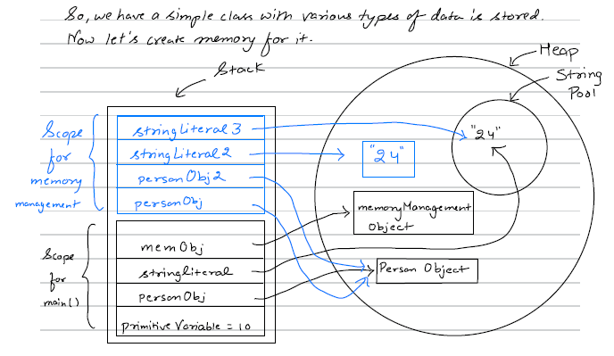
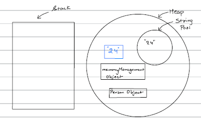
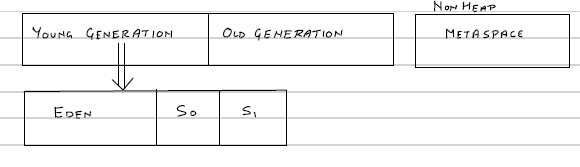
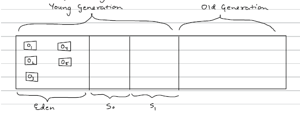
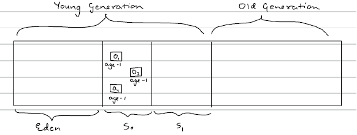
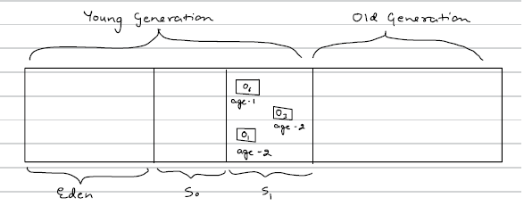
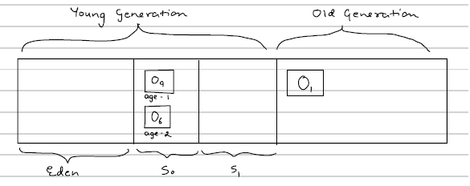

# Java Memory Management
---

Java memory management is handled automatically by the JVM (Java Virtual Machine).
There are 2 types of memory which Java creates. JVM manages these both:  
1) Stack
2) Heap 
---
## Stack  
- Stack stores temporary variables & separate memory block for methods  
- Store primitive data types
- Store reference of heap objects
- Strong reference
- Weak reference
    - Soft reference
- Each thread has its own stack memory
- Variables within a scope is only visible and as soon as any variable goes out of the Scope, it gets deleted from the Stack (in LIFO order)
- When stack memory goes full, it throws "java.lang.StackOverflowError"
---
## Heap
- Store objects & there is no order of allocating the memory
- Garbage Collector is used to delete unreferenced objects from the heap. (Mark & Sweep Algorithm)
- Types of Garbage Collector i.e Single GC,Parallel GC , G1 and CMS (concurrent Mark & Sweep)
- Heap memory is shared with all the threads.
---

Now let's understand both with the example
```java
public class Memorymanagement {
    public static void main(String[] args) {
        int primitiveVariable = 10;  // primitive (goes in stack)
        Person personObj = new Person();  // Object (goes in heap)
        String stringLiteral = "24";  // String literal (goes in String Constant Pool)
        Memorymanagement memObj = new Memorymanagement(); // Object (goes in heap)
        memObj.memoryManagementTest(personObj);
    }

    private void memoryManagementTest(Person personObj) {
        Person personObj2 = personObj;  // Object (refer to the existing object in heap)
        String stringLiteral2 = new String("24"); // String object (goes in heap)
        String stringLiteral3 = "24";  // String literal (goes in String Constant Pool)
    }
}
```


### When memoryManagementTest method ends: 
- As soon as we encounter the closing bracket of memoryManagementTest method, its scope ends, it will delete its scope so all of the blue portion of stack gets deleted (in LIFO order).
- Now control comes back to main method. Since nothing is there after calling memoryManagementTest api, we encounter the closing bracket which means the scope of main ends it's portion in stack begins to be deleted (in LIFO order).
- So now the stack is cleared and all the references are deleted from the stack as well. Now the memory looks like this - 

- Now the stack is cleared and all the references are deleted but the objects are in the heap. So that's where garbage collector's work starts. Garbage Collector will delete all the unreferenced Objects from the Heap.
- Garbage Collector runs periodically & JVM controls when to run the garbage collector. 
- We can also tell the JVM to run the garbage collector using System.gc() but this doesn't guarantee that GC will run that is why all of this is called automatic memory management. 
- The frequency of GC running is directly proportional to how much of the heap memory is currently full.

--- 

## Type Of References :
### Strong Reference -
- It is when a variable in stack is referencing an object in Heap memory
- Till the time the reference exists, GC won't be able to delete the object from the Heap Memory.
For eg : -
```java
Person pobj = new Person();
```
- So here pobj has strong reference to a Person Object in the heap memory. Till the time this reference exists, GC won't be able to delete Person object from Heap.

### Weak Reference -
- In weak reference also the reference exists to an object in the heap but as soon as GC runs the object is deleted from heap memory even if some variable is referencing this object from the stack. The variable in the stack will get null if it tries to access the object post GC run.
For eg : -
```java
WeakReference<Person> weakObj = new WeakReference<>(new Person());
```

### Soft reference -
- It is a type of weak reference but the difference is that in this case the object will be deleted only when there is shortage of space in Heap. 
- So GC is allowed to delete a soft reference but it'll keep the object if sufficient space is there in heap.
```java
SoftReference<Person> softObj = new SoftReference<>(new Person());
```

### Reference can be changed by referencing a current object to a new variable.
Eg:- 
```java
Person objl = new Person();  // created new object
Person Obj2 = new Person();  // created another object
obj1 = obj2;
```
- Now obj1 will have a reference for the object of obj2 in heap & when GC runs, the earlier object which objl was referring to will be deleted.

---

## Mark and Sweep algorithm :
- The Mark and Sweep algorithm is one of the basic Garbage Collection techniques used by the JVM to clean unused objects from Heap Memory.
- Heap memory is divided into two parts i.e. Young Generation and Old Generation. There is also one more part which is generally known as Non Heap (Metaspace). Before Java 7 it was called premgen.
- Now young generation is further divided into 3 parts named Eden, So and S1. So and S1, are known as survivor space. 


- Now let's see when we create an object, what happens to it .
- Whenever a new object is created, it goes to Eden first. Let's say we've created 5 objects o1,o2,o3,o4,o5. They'll be created in Eden first.
- So now heap memory looks like  (5 objects are created inside Eden)  


- Now let's say Garbage Collector run and there is no reference to o2 and o5 in the Heap Space. So now GC will use Mark & Sweep Algorithm i.e. in Mark, GC will mark the objects which no more have reference & then Sweep: in which it'll do 2 things :
    - First remove dereferenced objects o2 and o5, from the memory 
    - Move the rest of survivor objects into one of the Survivor space in So or S1, and adds age to the objects. 
- So after a GC runs, heap now looks like:  


- Now GC has run once. This whole process is called minor GC as it happens very periodically very fast.
- Let's now create 2 more objects o6 and o7.
- o6 and o7 are now created in Eden. Now Let's say the GC ran again and this
time no reference is there for o4 and o7 both. So now GC will:
- Mark o4 and o7
- Deletes o4 and o7
- Moves o1,o6 and o3 (Survivors) to S1, with corresponding ages.
Therefore post this minor GC, the heap looks like:


- So at one time Eden would be completely free after the GC and one of the survivor space (S0 or S1), would be free and we put data alternatively in S0 and S1, along with the respective age
- Now let's create two more objects o8 & o9.
- Now let's say I've set the threshold age to 3.
- Therefore now objects with age 3 needs to be promoted.
- Promotion means that now the objects with age 3 will be moved to old Generation
- Let's now run GC assuming that there are no more references to o3 and o8 hence will be deleted. So GC will now:
    - Mark o3 and o8
    - Delete o3 and o8
    - Move the survivor objects (o6 and o9) to S0 and Since o1 still have reference with age 3, it'll be promoted i.e. moved to old generation
- Now the heap looks like:  


- In the old generation only difference is that here it is called major GC because the GC in Old Generation won't run too periodically. 
- So in Old Generation the GC runs less periodically as compared to young generation and the objects in old generation are kind of big objects that are used too frequently and these might have a lot of references pointing to them.


Now let's come to metaspace. What will it store?  
The medaspace contains :-
- Class Variables
- Class metadata (basically stores information about class from which objects can be created)
- Constants
- `static` variables  
Note: metaspace is different from heap and it is expandable.
---

## Types of Garbage Collectors (GC) in Java

Java uses **Garbage Collection (GC)** to automatically manage memory by removing unused objects from the heap.

Below are the main types of Garbage Collectors available in Java (mainly from Java 8 → Java 17+).

---

| GC Type      | Threads Used | Pause Time | Best For |
|-------------|-------------|------------|----------|
| Serial GC   | Single      | High       | Small apps |
| Parallel GC | Multiple    | High       | High throughput |
| CMS         | Multiple    | Medium     | Low latency (old systems) |
| G1 GC       | Multiple    | Low-Medium | Enterprise apps |
| ZGC         | Multiple    | Very Low   | Large scale, cloud |
| Shenandoah  | Multiple    | Very Low   | Low latency systems |


👉 **Default GC in Java 8 → Parallel GC**  
👉 **Default GC in Java 9+ → G1 GC** 

**Q: Which GC should we choose?**  
Answer:  
- Small app → Serial  
- High throughput → Parallel  
- Balanced performance → G1  
- Ultra low latency → ZGC / Shenandoah


---

## What is `-Xmx` and `-Xms` in Java?

In Java, `-Xms` and `-Xmx` are **JVM options** used to control the **Heap Memory size**.

Heap memory is where **Java objects are created and stored**.

---

### 🔹 1️⃣ -Xms (Initial Heap Size)

`-Xms` defines the **initial heap size** allocated when the JVM starts.

✅ Syntax:
```sh
-Xms<size>

# ✅ Example:
-Xms512m    # 👉 JVM starts with **512 MB heap memory**.
```

### 🔹 2️⃣ -Xmx (Maximum Heap Size)

`-Xmx` defines the **maximum heap size** JVM is allowed to use.

✅ Syntax:
```sh
-Xmx<size>

# ✅ Example:
-Xmx2g     # 👉 JVM can grow heap up to **2 GB**.
```
✔ JVM starts with 512 MB    
✔ Can grow dynamically up to 2 GB 

If heap usage exceeds the limit →  
🚨 **OutOfMemoryError: Java heap space**


## 🚀 Example Command
```sh
java -Xms1g -Xmx4g -jar myapp.jar
```


