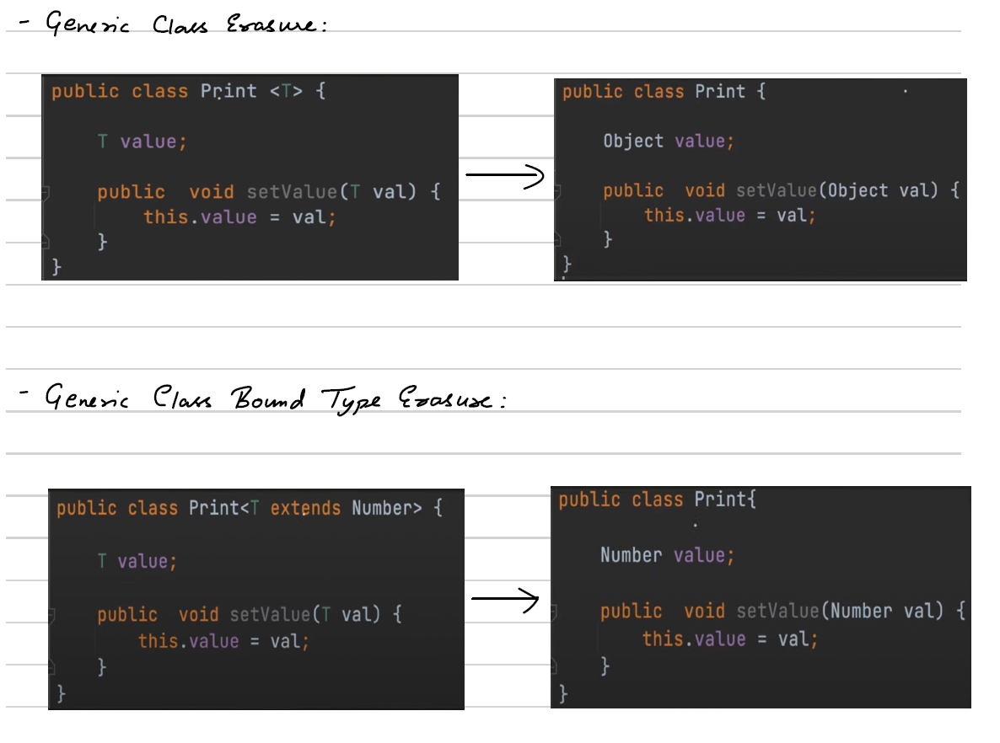
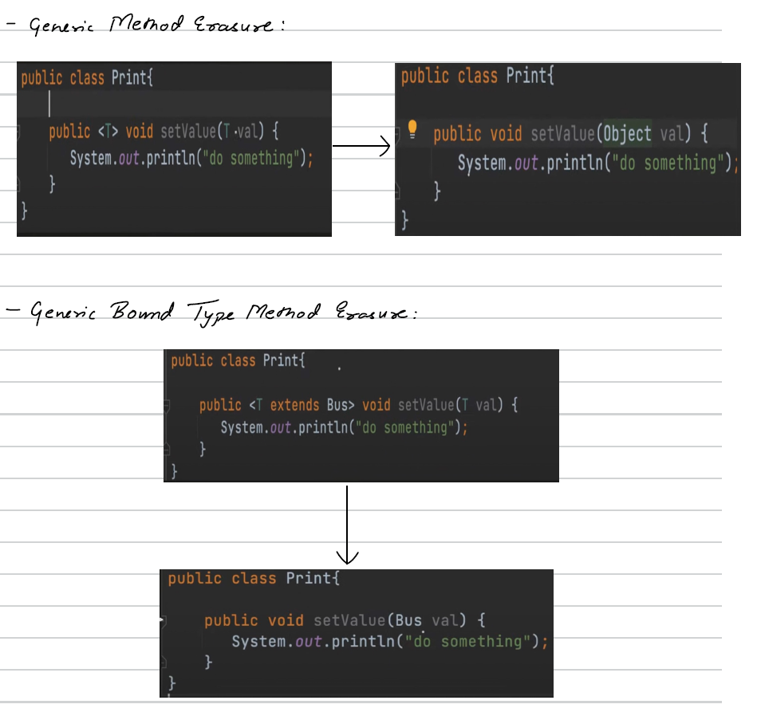
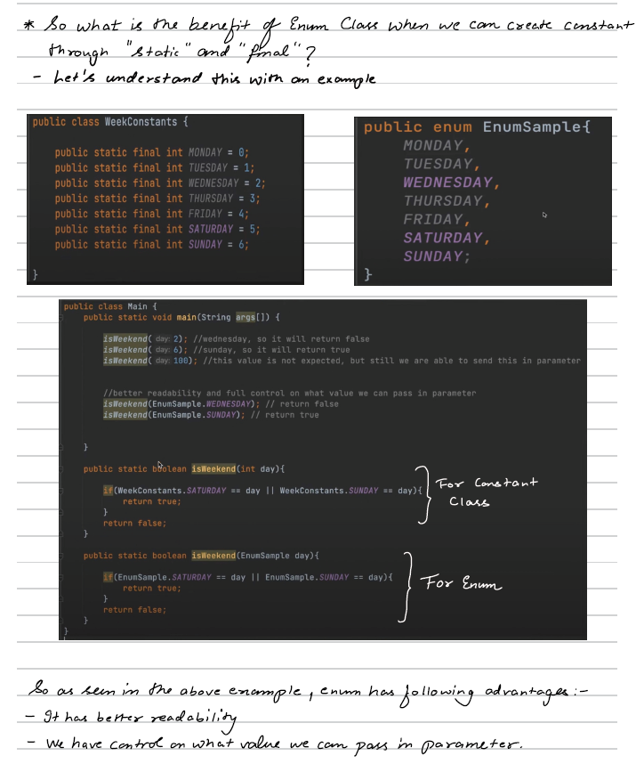
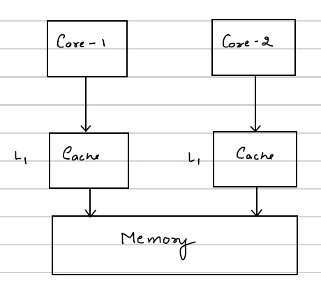

# 📘 Classes in Java
---

## 🔹 What is a Class?

A **class** is a blueprint/template used to create objects.

---

## Types of Classes in Java

## 1️⃣ Concrete Class  
- Can be instantiated using `new`
- Has full method implementation
```java
class Car {
    void drive() {
        System.out.println("Driving...");
    }
}


Car c = new Car();  // Allowed
```
- Can extend abstract class.
- Can implement interfaces.
- Access modifier: `public` or `default` (package-private).

---

## 2️⃣ Abstract Class : A class declared using `abstract` keyword.
- Cannot be instantiated.
- May contain abstract methods (without body).
- Can also have concrete methods. (implementation)
```java
abstract class Animal {
    abstract void sound();

    void sleep() {
        System.out.println("Sleeping...");
    }
}


class Dog extends Animal {
    void sound() {
        System.out.println("Bark");
    }
}
```
- Used for partial abstraction.
- Can have constructors.
- Can have static methods.
- Can have final methods.


**Note: Abstract classes have constructors to initialize the state of their fields and perform setup tasks, even though they cannot be instantiated directly. When a concrete subclass is created, its constructor invokes the abstract base class constructor via constructor chaining, ensuring common initialization logic executes and preventing code duplication.**

---

## 3️⃣ Superclass and Subclass  
Subclass: A class that is derived from another class.  
Superclass: A class through which a subclass is derived.

```java
class Vehicle {
    void start() {
        System.out.println("Vehicle starting");
    }
}

class Bike extends Vehicle {
    void ride() {
        System.out.println("Bike riding");
    }
}
```

---

## 4️⃣ Object Class
- `java.lang.Object` is the root class of Java.
- **Every class implicitly extends Object class.**
- Common methods:
  - toString()
  - equals()
  - hashCode()
  - clone()
  - finalize()
  - getClass()

```java
class Test { }

Test t = new Test();
System.out.println(t.toString());
```

**Note: Since Object is the parent class of every class and in Java we know that reference of child class can be kept in parent class, hence any class' objects can be kept in reference of object class.**


---

## 5️⃣ Nested Classes:
Classes defined inside another class.

### Types of Nested Classes
A) Inner Class (Non-static Nested Class)
```java
class Outer {
    class Inner {
        void display() {
            System.out.println("Inner class");
        }
    }
}
```
✔ To invoke it, we will need outer class instance.

B) Local Inner Class
```java
class Outer {
    void show() {
        class Local {
            void display() {
                System.out.println("Local inner class");
            }
        }
        new Local().display();
    }
}
```

C) Anonymous Inner Class
```java
Runnable r = new Runnable() {
    public void run() {
        System.out.println("Running");
    }
};
```
Like this, we can implement abstract class as well. Now we know that we cannot create an object of abstract class but here we had done. 
Let's understand what happened. So 2 things happened behind the scene :
- Sub class is created, name decided by the compiler
- Creates an object of Sub class and assigns its reference to object. Similarly for interface also, it works in the same way.


D) Static Nested Class
```java
class Outer {
    static class Nested {
        void display() {
            System.out.println("Static nested class");
        }
    }
}
```
✔ To invoke it, Does not need outer instance.

---

## Generic classes 
---
Generic class helps us to write a class in a generic manner that helps to avoid the typecasting that we'll have to use with Object class.  

Let's see an example -
```java
public class GenericTest {
    private Object value;

    public Object getValue() {
        return value;
    }

    public void setValue(Object value) {
        this.value = value;
    }
}
```
Since Object is parent of every class, we used it here. Now here value can be of any type: String, integer etc. The only issue is that we'll have to typecast it as per our use.
```java
public class Test {

    public static void main(String[] args) {
        GenericTest genericTest = new GenericTest();
        genericTest.setValue(10);
        Object value = genericTest.getValue();

        //We can not use value directly, we have to typecast it, else we will get ❌ Compile-time error.
        if((int) value==10){
            //do something
        }
    }
}
```
So we had to typecast value to int to compare it with 10.

---

### How to define Generic classes?
We can do it using ```<T>```, this T can be any alphabet like A, B, C etc. So let's make our previous Class generic
```java
public class GenericTest<T> {
    private T value;

    public T getValue() {
        return value;
    }

    public void setValue(T value) {
        this.value = value;
    }
}
```
Generic Type (In above example <T>) can be **any non-primitive** object.

```java
public class Test {

    public static void main(String[] args) {
        GenericTest<Integer> genericTest = new GenericTest<>();
        genericTest.setValue(10);
        Integer value = genericTest.getValue();

        if(value==10){
            //do something
        }
    }
}
```
Therefore, while creating genericTest object, We replaced T by Integer making it of an Integer type.

---

### Inheritance In Generic Classes
1) Non-Generic Subclass
```java
public class Print<T> {
    private T value;

    public T getValue() {
        return value;
    }

    public void setValue(T value) {
        this.value = value;
    }
}

class ColorPrint extends Print<String>{
    
}
```
- So, here we have extended and inherited a Generic Class to a non-generic subclass.
- While extending (inheriting) a generic class to a non-generic subclass, we have to define the type of T at the time of extending itself.

---

2) Generic Subclass
```java
public class Print<T> {
    private T value;

    public T getValue() {
        return value;
    }

    public void setValue(T value) {
        this.value = value;
    }
}

class ColorPrint<T> extends Print<T>{

}
```
```java
public class Test {
    public static void main(String[] args) {
        ColorPrint<String> colorPrint = new ColorPrint<>();
        colorPrint.setValue("Red");
     }
}
```
- So, for a non-generic subclass, we can specify the type of T at the time of object creation.

---

### More than one Generics Type Example :  
We can create as many number of generic parameters as we want i.e. T1, T2, T3, T4 -- TN. (Classname <T1, T2, T3, T4 -- TN>)
```java
public class Pair<K,V> {
    private K key;
    private V value;

    public void put(K key, V value){
        this.key = key;
        this.value = value;
    }
}
```
```java
public class Test {
    public static void main(String[] args) {
        Pair<Integer,String> pair = new Pair<>();
        pair.put(10,"test");
     }
}
```
- So, here we've used two generic parameters.
- Also, both the Syntaxes are right :
```java
Pair<Integer,String> pair = new Pair<>();
Pair<Integer,String> pair = new Pair<Integer,String>();
```

---

## Generic methods  
- If we want to make only a method generic, not the whole class then we can write generic method. 
- Type parameter should be before return type of the method declaration.
- Type parameter scope is limited to method only.
- example -
```java
public class GenericMethod {
    public <K,V> void printValue(Pair<K,V> pair1, Pair<K,V> pair2){
        //do something
    }

    public <K,V> void printValue(K key, V value){
        //do something
    }

    public <T> void setValue(T value){
        //do something
    }
}
```

### Raw type object 
It's a name of the generic class or interface without any type argument.
```java
public class Print<T> {
    private T value;

    public T getValue() {
        return value;
    }

    public void setValue(T value) {
        this.value = value;
    }
}
```
```java
public class Test {
    public static void main(String[] args) {
        Print<Integer> parameterTypeObject = new Print<>();

        Print rawTypeObject = new Print();
        rawTypeObject.setValue(10);
        rawTypeObject.setValue("hello");
     }
}
```
- So while creating the object, we didn't pass any type as parameterized type. Therefore  internally it passes Object as parameterized type.  


### Bounded generics  
- It can be used at generic class and generic method. 
- Upper bound - ```<T extends Number>``` means T can be of type Number or its subclass only. We can use interface as a superclass(in this case Number) too.
- Multi bound - ```<T extends ParentClass & Interface1, Interface2>```. The first restrictive class should be concrete class. 2,3...and so on can be interfaces.

---

## Wildcards (?)
- Upper bounded wildcard - ```<? extends UpperBoundClassName>```
- Lower bounded wildcard - ```<? super LowerBoundClassName>```
- Unbounded wildcard - ```<?>```

let's say we have a Vehicle class. Bus and Car extends it. then -
```java
public class Main {
    public static void main(String[] args) {
        List<Vehicle> vehicleList =  new ArrayList<>();
        vehicleList.add(new Bus());
        vehicleList.add(new Car());

        List<Bus> busList =  new ArrayList<>();
        busList = vehicleList;  // invalid (❌ Compile-time error)
        vehicleList = busList;  // invalid (❌ Compile-time error)

        Vehicle vehicle = new Vehicle();
        Bus bus = new Bus();
        vehicle = bus;  // valid
    }
}
```
- Here both the above assignments are invalid because lists are different from objects ```busList = vehicleList;``` this is invalid because in bus list we can store only the objects of type Bus.
- ```vehicleList = buslist;``` is also invalid because in vehicleList we can store both Bus and car objects while bus List can contain only bus objects. Hence, it is invalid.

So , here wildcards can help us :
```java
public class Print<T> {
    public void setPrintValue(List<? extends Vehicle> vehicleList){
        
    }
}
```
So we've used Upper bounded wildcard. We can pass Vehicle and its child classes.
```java
public class Main {
    public static void main(String[] args) {
        //Pass vehicleList
        List<Vehicle> vehicleList =  new ArrayList<>();
        vehicleList.add(new Bus());
        vehicleList.add(new Car());

        Print printObj1 = new Print();
        printObj1.setPrintValue(vehicleList);  //this is valid

        //Pass busList
        List<Bus> busList =  new ArrayList<>();
        
        Print printObj2 = new Print();
        printObj2.setPrintValue(busList); //this is valid
    }
}
```
So now we can pass vehicleList as well as busList Since vehicleList & its child classes are allowed.

Now let's see lower bound wild cards :
```java
public class Print {
    public void setPrintValue(List<? super Vehicle> vehicleList){

    }
}
```
Now we can pass vehicle & its superclass type. Since vehicle is not inheriting anything, So object can be used along with vehicle.
```java
//Pass objectList
List<Object> objectList =  new ArrayList<>();
Print printObj2 = new Print();
printObj2.setPrintValue(objectList); //this is valid
```
Now a question arises that can't we use generic type parameter in place of wildcards to achieve the functionality. Let's see the difference between Wildcard & generic type. Let's create one wildcard method and one generic type method :
```java
public class Print {

    //wildcard method
    public void computeListWild(List<? extends Number> source, List<? extends Number> destination){

    }

    //generic type method
    public <T extends Number> void computeListGeneric(T source, T destination){

    }

}
```
1. The main difference is that wildcards are a bit less restrictive as compared to generic type. For example, in above code, we can give 2 different type of lists as source and destination for the wildcard but for generic method we have to give same type of list to source and destination.
2. In wildcard we have lower bound as well i.e we can use super but in generic method we can't do so.
```java
public class Main {
    public static void main(String[] args) {
        List<Integer> wildCardSourceInt = new ArrayList<>();
        List<Long> wildCardDestLong = new ArrayList<>();

        Print print =  new Print();
        print.computeListWild(wildCardSourceInt,wildCardDestLong); //valid

        print.computeListGeneric(wildCardSourceInt,wildCardDestLong); //invalid (❌ Compile-time error)
    }
}
```
---

### Unbounded Wildcard (`<?>`)
An **unbounded wildcard** means:
> “This can be any type.”

Syntax:

```java
List<?> list;
```
It means:
- list can be `List<String>`
- list can be `List<Integer>`
- list can be `List<Object>`  
etc.
```java
import java.util.*;

public class Test {
    public static void printList(List<?> list) {
        for (Object obj : list) {
            System.out.println(obj);
        }
    }

    public static void main(String[] args) {
        List<String> names = List.of("A", "B", "C");
        List<Integer> numbers = List.of(1, 2, 3);

        printList(names);
        printList(numbers);
    }
}
```
Important Rule:
❌ You CANNOT ADD elements (except null)
```
List<?> list = new ArrayList<String>();

list.add("Hello");  ❌ Compile-time error
list.add(10);       ❌ Compile-time error
list.add(null);     ✔ Allowed
```
Why?
- Because compiler does not know the exact type.
- It could be `List<String>` or `List<Integer>`.
- If Java allowed adding "Hello" to List<Integer>, type safety breaks.

---

## Type Erasure
Type Erasure means:
> Java removes generic type information at **compile time**.  

- Generics exist only at **compile time**, not at runtime.  
- At runtime, JVM sees raw types.  

🔹 How Type Erasure Works
During compilation:
1. Generic type parameters are removed.  
2. Type parameters are replaced with:  
   - `Object` (if unbounded)  
   - Bound type (if bounded)  
3. Type casts are added where required.  
4. Bridge methods may be generated.  




---

## POJO class  
**POJO** stands for:
> **Plain Old Java Object**

A POJO is a simple Java class that:
- Does NOT extend any special class
- Does NOT implement any special interface (like `Serializable` is optional)
- Has private fields
- Has public getters and setters
- Contains minimal logic (mostly data holder)
It is mainly used to represent **data**.

### Basic Structure of a POJO
```java
public class Employee {

    private int id;
    private String name;
    private double salary;

    // Default constructor
    public Employee() {
    }

    // Parameterized constructor
    public Employee(int id, String name, double salary) {
        this.id = id;
        this.name = name;
        this.salary = salary;
    }

    // Getters & Setters
    public int getId() {
        return id;
    }

    public void setId(int id) {
        this.id = id;
    }

    public String getName() {
        return name;
    }

    public void setName(String name) {
        this.name = name;
    }

    public double getSalary() {
        return salary;
    }

    public void setSalary(double salary) {
        this.salary = salary;
    }

    @Override
    public String toString() {
        return "Employee{id=" + id + ", name='" + name + "', salary=" + salary + "}";
    }
}
```
Note:
Whenever any request comes into our system (i.e., when a component receives data), it is advisable to map the request object to a POJO that all internal classes understand and use.
This way, if anything changes in the future, we only need to modify that single POJO instead of updating multiple classes across the system.

---

## ENUM Class  
### 🔹 What is an Enum?
**Enum** (Enumeration) is a special type of class in Java used to represent a **fixed set of constants**.
Example:
```java
enum Day {
    MONDAY,
    TUESDAY,
    WEDNESDAY
}

public class Test {
    public static void main(String[] args) {
        Day today = Day.MONDAY;
        System.out.println(today);
    }
}
```
 ### Important Features of Enum
 1️⃣ Enum is a Special Class
Internally:
- Enum extends java.lang.Enum
- Cannot extend any other class
- Can implement interfaces

2️⃣ Enum Can Have Fields, Constructors & Methods
```java
enum Role {

    ADMIN("Full Access"),
    USER("Limited Access");

    private String description;

    Role(String description) {   // constructor
        this.description = description;
    }

    public String getDescription() {
        return description;
    }
}

//usage 
System.out.println(Role.ADMIN.getDescription());
```
✔ Enum constructor is always private (even if not written).

3️⃣ Enum with Switch
```java
enum PaymentStatus {
    SUCCESS, FAILED, PENDING
}

public class Test {
    public static void main(String[] args) {
        PaymentStatus status = PaymentStatus.SUCCESS;

        switch (status) {
            case SUCCESS -> System.out.println("Payment done");
            case FAILED -> System.out.println("Payment failed");
            case PENDING -> System.out.println("Payment pending");
        }
    }
}
```

4️⃣ Enum Methods (Built-in)
Every enum has:
| Method      | Description                   |
| ----------- | ----------------------------- |
| `values()`  | Returns all enum constants    |
| `valueOf()` | Returns enum constant by name |
| `ordinal()` | Returns index position        |
| `name()`    | Returns constant name         |

```java
for (Status s : Status.values()) {
    System.out.println(s + " " + s.ordinal());
}
```

### Enum with Abstract Method
Each constant can provide its own implementation.
```java
enum Operation {

    ADD {
        double apply(double x, double y) {
            return x + y;
        }
    },
    SUBTRACT {
        double apply(double x, double y) {
            return x - y;
        }
    };

    abstract double apply(double x, double y);
}
```
- Each variable defined inside an enum class is applicable to every constant in that enum. In other words, every constant is an object of the enum class and contains those defined variables.
- If we define a parameterized constructor in an enum, it will be invoked once for each constant at the time the enum is initialized.
- If we want to define a method that belongs to the enum as a whole (not tied to individual constants), we should make it static. Otherwise, the method will be associated with each constant (since each constant is an instance of the enum).


### Overriding a Concrete Method in Enum
```java
enum Operation {

    ADD {
        @Override
        public int apply(int x, int y) {
            return x + y;
        }
    },

    MULTIPLY {
        @Override
        public int apply(int x, int y) {
            return x * y;
        }
    };

    public int apply(int x, int y) {
        return 0;
    }
}
```

### Enum implementing interface
```java
interface DummyInterface{
    String toLower();
}

enum Day implements DummyInterface {
    MONDAY,
    TUESDAY,
    WEDNESDAY;

    @Override
    public String toLower() {
        return this.name().toLowerCase();
    }
}
```
So here enum implements an interface and We can call toLower method for every constant.



---

## Final class
It is a class which cannot be inherited.

---

## Singleton class 
A **Singleton** is a design pattern that ensures:   
> Only **one instance** of a class exists in the JVM    
> And provides a **global access point** to it.  

### 🔥 Why Use Singleton?
Used when exactly one object is needed, such as:  
✔ Logger  
✔ Configuration manager  
✔ Database connection manager  
✔ Cache manager  

### Different ways to create Singleton class
1. Eager Initialization : 
- Instance is created at class loading time.
```java
public class Singleton {

    private static final Singleton INSTANCE = new Singleton();

    private Singleton() { }   // private constructor

    public static Singleton getInstance() {
        return INSTANCE;
    }
}
```

✔ Pros:  
- Simple  
- Thread-safe (class loading is thread-safe)  

❌ Cons:  
- Instance created even if not used  

---

2. Lazy Initialization (Not Thread Safe ❌)  
- Instance created only when needed.  
```java
public class Singleton {

    private static Singleton instance;

    private Singleton() { }   // private constructor

    public static Singleton getInstance(){
        if(instance == null){
            instance = new Singleton();
        }
        return instance;
    }
}
```
❌ Problem:  
- Not thread-safe.  
- Two threads may create two objects.  

--- 

3. Thread-Safe Singleton (Synchronized Method)
```java
public class Singleton {

    private static Singleton instance;

    private Singleton() { }   // private constructor

    public static synchronized Singleton getInstance(){
        if(instance == null){
            instance = new Singleton();
        }
        return instance;
    }
}
```
❌ Problem:  
Synchronization slows performance.

---

4. Double-Checked Locking (Best Practice)
```java
public class Singleton {

    private static volatile Singleton instance;

    private Singleton() { }   // private constructor

    public static Singleton getInstance() {
        if (instance == null) {
            synchronized (Singleton.class) {
                if (instance == null) {
                    instance = new Singleton();
                }
            }
        }
        return instance;
    }
}
```
---

#### Memory Issue in Double Checked Locking (Simple Explanation)
In multi-core systems:
- Each CPU core has its own **L1 Cache**
- All cores share **main memory**
- Cache and memory are synchronized periodically (not instantly)



- So different threads may see **different values temporarily**.
- Each core has its dedicated L1 Cache which is used to cache the objects and time to time it syncs with memory.
- Now let's say Thread T1's computation is happening at core-1 and it enters the method to get object. Since it'll get null for the first time an object will be created and temporarily stored in cache. 
- At this point T2 whose computation is happening at Core-2 tries to get the object. 
- Now though we do have the object created but not yet synced with the memory. Hence a second object will be created because the object is not there in memory. Therefore two objects are created despite double checked locking.
- This is solved using the volatile keyword. Volatile Keyword means that the object will be created in memory instead of cache.
- So, if we've created any object volatile, any read/write operation happening to this always happens in memory
- Since we're using memory synchronized , this is also a bit slow.
--- 

5. Best & Modern Approach (Enum Singleton ⭐)
```java
public enum Singleton {
    INSTANCE;

    public void showMessage() {
        System.out.println("Singleton using Enum");
    }
}
```
✔ Advantages:
- Thread-safe
- Serialization safe
- Reflection safe
- Simplest implementation

---

6. Bill Pugh Singleton (Best Lazy + Thread-Safe Implementation)
Bill Pugh Singleton uses the concept of:
> Inner static class + JVM class loading mechanism

It is:  
✔ Lazy initialized    
✔ Thread-safe    
✔ No synchronization overhead    
✔ Cleaner than Double Checked Locking  

```java
public class Singleton {

    private Singleton() { }

    // Inner static class
    private static class SingletonHolder {
        private static final Singleton INSTANCE = new Singleton();
    }

    public static Singleton getInstance() {
        return SingletonHolder.INSTANCE;
    }
}
```

#### How It Works
1️⃣ Outer class is loaded → INSTANCE is NOT created.  
2️⃣ Only when getInstance() is called →  SingletonHolder class gets loaded.
3️⃣ JVM loads inner static class lazily.  
4️⃣ Class loading is thread-safe → so INSTANCE is created only once.  

#### Why It Is Thread Safe?
Because:  
✔ JVM guarantees class initialization is thread-safe.  
✔ Inner class is not loaded until referenced.  
✔ No need for synchronized.  


--- 

## IMMUTABLE CLASSES
- An immutable class is a class whose objects cannot be changed after they are created.
- Once you create the object, its data (state) stays the same for the entire lifetime of that object.
```java
final class Person {
    private final String name;

    public Person(String name) {
        this.name = name;
    }

    public String getName() {
        return name;
    }
}
```
Here:  
- After creating new Person("John")  
- You cannot change the name to something else.

### 🔹 Rules to Make a Class Immutable
1️⃣ Make the class final  
2️⃣ Make all fields private and final  
3️⃣ Initialize fields through constructor only (No setter methods allowed.)  
4️⃣ Provide only getter methods  
5️⃣ If class contains mutable objects, return copies (defensive copy)  
example:  
```java
public Date getDate() {
    return new Date(date.getTime());
}
```
---

## Wrapper Class
- We've already discussed it in Java Variables part.


