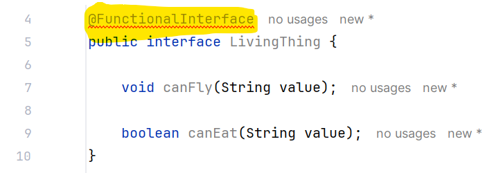
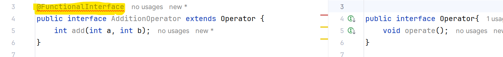
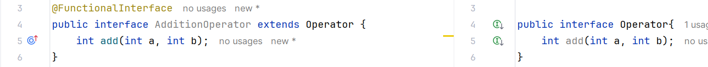
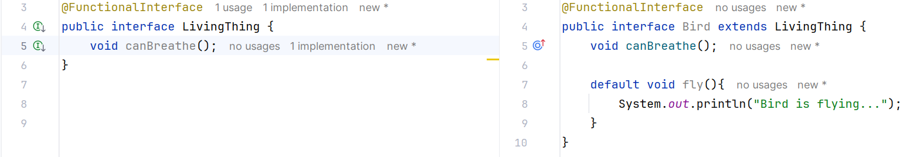
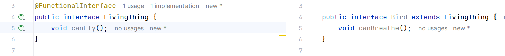

# Java Interface
---

## What is interface?
- Interface is something which helps 2 systems to interact with each other, without one system has to know the details of other.
- In simple terms, it helps achieve abstraction.
---

## How to define an Interface?
Interface declaration consists of:
- Access modifiers **(Only public and default are allowed)**
- `interface` keyword
- Interface name
- Comma separated list of parent interfaces (if there are any)
- Body
```java
public interface Bird {
    void fly();
}
```

```java
interface Bird {
    void fly();
}
```
---

## Why we need interface?
1) Abstraction  
- Using interface we can achieve full abstraction. Means we can define what a class must do not how it will do it.
```java
public interface Bird {
    void fly();
}

public class Eagle implements Bird{

    @Override
    public void fly() {
        // Actual implementation
    }
}
```
2) Polymorphism
- Interface can be used as a data type.
- We can not create the object of an interface, but it can hold the reference of all the classes which implements it. And at runtime, it decides which method need to be invoked.
```java
public interface Bird {
    void fly();
}

public class Eagle implements Bird{
    @Override
    public void fly() {
        System.out.println("Eagle is flying");
    }
}

public class Hen implements Bird {
    @Override
    public void fly() {
        System.out.println("Hen is flying");
    }
}

public class Main {
    public static void main(String[] args) {
        Bird eagle = new Eagle();
        eagle.fly(); // "Eagle is flying"
        
        Bird hen = new Hen();
        hen.fly();  // "Hen is flying"
    }
}
```

3) Multiple inheritance 
- In java, Multiple inheritance can be achieved only using interface.
- Diamond problem:
```java
public class WaterAnimal {
    public boolean canBreathe(){
        return true;
    }
}

public class LandAnimal {
    public boolean canBreathe(){
        return true;
    }
}

// this is invalid with compile time error - "Class cannot extend multiple classes"
public class Crocodile extends WaterAnimal, LandAnimal {
}

// because if this was allowed then which canBreathe() method to call in below scenario is ambiguous
public class Main {
    public static void main(String[] args) {
        Crocodile crocodile = new Crocodile();
        crocodile.canBreathe(); // ambiguous method call
    }
} 
```
This problem can be solved using interface -
```java
public interface WaterAnimal {
    boolean canBreathe();
}

public interface LandAnimal {
    boolean canBreathe();
}

public class Crocodile implements WaterAnimal, LandAnimal {
    @Override
    public boolean canBreathe() {
        return true;
    }
}

public class Main {
    public static void main(String[] args) {
        Crocodile crocodile = new Crocodile();
        crocodile.canBreathe();  // true
    }
}
```

## Methods in interface
- All methods are implicit public only.
- Method can not be declared as final. 

## Fields in interface
- All fields are public, static and final implicitly (CONSTANTS)
- You can not make field private or protected.
```java
public interface Bird {
    int MAX_HEIGHT_IN_FEET = 2000;
    void fly();
}
```
`==`
```java
public interface Bird {
    public static final int MAX_HEIGHT_IN_FEET = 2000;
    void fly();
}
```

## Interface implementation
- Overriding method can not have more restrictive access modifiers.
```java
public interface Bird {
    void fly();
}

public class Eagle implements Bird{
    // This is invalid 
    @Override
    protected void fly() {  // CE: 'fly()' in 'org.example.Eagle' clashes with 'fly()' in 'org.example.Bird'; attempting to assign weaker access privileges ('protected'); was 'public'
        System.out.println("Eagle is flying");
    }
}
```
- Concrete class implementing interface must implement all the declared methods in interface. 
- Abstract class implementing interface is not forced to implement all the declared methods in interface.
```java
public interface Bird {
    void fly();
    void noOfLegs();
}

public abstract class Eagle implements Bird{
    @Override
    public void fly() {
        System.out.println("Eagle is flying");
    }
}

public class WhiteEagle extends Eagle{
    @Override
    public void noOfLegs() {
        // actual implementation
    }
}
```
- A class can implement multiple interfaces.

---

## Nested interface 
- Nested interface can be declared within another interface.
- Nested interface can be declared within a class.

🔹Rules:
- A nested interface declared within interface is by default `public` (other modifiers are not allowed).
```java
public interface Bird {
    void fly();

    interface nonFlyingBird{
        void canRun();
    }
}
```
- A nested interface declared within class can have any access modifier.
- When we implement outer interface, inner interface implementation is not mandatory and vice versa.
```java
public interface Bird {
    void fly();

    interface nonFlyingBird{
        void canRun();
    }
}

// Implementing only outer interface is valid 
public class Eagle implements Bird{
    @Override
    public void fly() {
        System.out.println("Eagle is flying");
    }
}

// or Implementing only outer interface is also valid

public class Eagle implements Bird.nonFlyingBird{
    @Override
    public void canRun() {
        // actual implementation
    }
}

// Implementing both inner and outer interface
public class Eagle implements Bird, Bird.nonFlyingBird{
    @Override
    public void fly() {
        // actual implementation
    }

    @Override
    public void canRun() {
        // actual implementation
    }
}

```
---

## Difference between interface and abstract class
| S.No | Abstract Class | Interface |
|------|----------------|------------|
| 1 | Keyword used here is `abstract` | Keyword used here is `interface` |
| 2 | Child classes need to use keyword `extends` | Child classes need to use keyword `implements` |
| 3 | It can have both abstract and non-abstract methods | It can have only abstract methods (From Java 8 onwards it can have default, static and private methods where we can provide implementation) |
| 4 | It can extend from another class and multiple interfaces | It can only extend from other interfaces |
| 5 | Variables can be static, non-static, final, non-final etc. | Variables are by default CONSTANTS |
| 6 | Variables and methods can be private, protected, public, default | Variables and methods are by default public (In Java 9, private methods are supported) |
| 7 | Multiple inheritance is not supported | Multiple inheritance is supported in Java using interfaces |
| 8 | It can provide the implementation of the interface | It cannot provide the implementation of any other interface or abstract class |
| 9 | It can have a constructor | It cannot have a constructor |
| 10 | To declare a method abstract, we must use the "abstract" keyword and it can be protected, public, or default | No need to use any keyword to make a method abstract. By default, it is public |

---

## Java8 interface features 
---
## Default method
- Before Java 8, interfaces could contain only abstract methods, and every implementing class was required to provide its own implementation.
- The drawback of this approach was that even a small change to a method required modifying all implementing classes.
- Using default method :
```java
//interface
public interface Bird {
    void fly();
    
    default int getMaxSpeed() {
        return 100; // Default max speed for birds
    }
}

//implementation
public class Eagle implements Bird {
    @Override
    public void fly() {
        System.out.println("Eagle is flying");
    }
}

//usage
public class Main {
    public static void main(String[] args) {
        Bird eagle = new Eagle();
        eagle.fly();
        eagle.getMaxSpeed(); // This will call the default method from the Bird interface
    }
}
```

### How to handle diamond problem w.r.t default methods?
```java
public interface Bird {
    default boolean canBreathe() {
        return true; // Default behavior for birds
    }
}


public interface LivingThing {
    default boolean canBreathe() {
        return true; // Default behavior for living things
    }
}

// It is mandatory to provide implementation of the default method in such cases.
public class Eagle implements Bird, LivingThing {
    public void fly() {
        System.out.println("The eagle is flying.");
    }

    @Override
    public boolean canBreathe() {
        return Bird.super.canBreathe(); // Resolving the conflict by choosing Bird's implementation
    }
}
```
**Note: It is mandatory to provide implementation of the default method in such cases.**

### How to extend interface, that contains Default method?
1) Don't touch parent method -
```java
//parent interface
public interface LivingThing {
    default boolean canBreathe() {
        return true; // Default behavior for living things
    }
}

//child interface
public interface Bird extends LivingThing {
    void fly();
}

//implementation class
public class Eagle implements Bird {
    public void fly() {
        System.out.println("The eagle is flying.");
    }
}

//usage
public class Main {
    public static void main(String[] args) {
        Bird eagle = new Eagle();
        eagle.canBreathe();  // This will return true, as it's the default behavior defined in LivingThing
    }
}
```

2) Hide parent's default method and force implementation -
```java
//parent interface
public interface LivingThing {
    default boolean canBreathe() {
        return true; // Default behavior for living things
    }
}

//child interface
public interface Bird extends LivingThing {
    boolean canBreathe(); // This method will override the default implementation from LivingThing
}

//implementation class
public class Eagle implements Bird {
    @Override
    public boolean canBreathe() {
        return false;
    }
}

//usage
public class Main {
    public static void main(String[] args) {
        Bird eagle = new Eagle();
        eagle.canBreathe(); // This will call the canBreathe implementation from Eagle class
    }
}
```

3) Override parent's default method in child -
```java
//parent interface
public interface LivingThing {
    default boolean canBreathe() {
        return true; // Default behavior for living things
    }
}

//child interface
public interface Bird extends LivingThing {
    default boolean canBreathe() {
        return false; // Default behavior for birds
    }
}

//implementation class
public class Eagle implements Bird {

}

//usage
public class Main {
    public static void main(String[] args) {
        Bird eagle = new Eagle();
        eagle.canBreathe(); // This will call the canBreathe method defined in Bird, which returns false
    }
}
```
---

## Static method
- We can provide implementation of the method in interface.
- But it cannot be overridden by implementing class.
- We can access it through interface name.
- It is by default public.
```java
//interface with static method
public interface Bird {
    static boolean canBreathe() {
        return false; // Default behavior for birds
    }
}

//implementation class
public class Eagle implements Bird {
        public void isAlive(){
            if(Bird.canBreathe()){
                System.out.println("Eagle can breathe and is alive.");
            }
        }
}


//usage
public class Main {
    public static void main(String[] args) {
        Eagle eagle = new Eagle();
        eagle.isAlive();
    }
}
```
### Some important notes -
- If we try to override the static method in implementation class, it will be considered as new method.
- If we try to add `@override` annotation, it will throw CE.
- default methods can be overridden but static methods can not be.

--- 

## Java9 interface features 
---
## private method and private static method
- This is simply the private method or private static method but in interface.
- The main purpose is usability. If multiple default methods share same code then this can help.
- `private` method cannot be `abstract`. 
- As it is private, it can be used only inside the interface where it is defined.
```java
public interface Bird {
    default boolean isFlyingAndAlive() {
        return isLivingThing() && canFly(); // A bird is alive if it is a living thing and can fly
    }

    private boolean isLivingThing(){
        return true; // Assuming all birds are living things
    }

    private boolean canFly(){
        return true; // Assuming all birds can fly
    }
}
``` 
---

## Functional interface and lambda expressions
---
### What is a functional interface?
- An interface with exactly one abstract method.
- Can have any number of default and static methods.
- Annotated with `@FunctionalInterface` (optional but recommended). If we add the annotation then it will not allow us to add more than one abstract method. If we do so, we get CE: `Multiple non-overriding abstract methods found in interface org.practice.oops.LivingThing`

- Valid FunctionalInterface -
```java
@FunctionalInterface
public interface LivingThing {
    void canBreathe();

    default boolean isLivingThing() {
        return true; // Assuming all living things can breathe
    }
}
```
---
### What is lambda expression? And how to use a functional interface with lambda expression?
- A short way to write anonymous methods (functional code).
- Used to implement the abstract method of a functional interface.
- There are 3 ways to implement a functional interface => Using implementing class, Using anonymous class and Using lambda expression.
- Consider the below functional interface –
```java
@FunctionalInterface
public interface AdditionOperator {
    int add(int a, int b);
}
```
1. Using class =>  
```java
public class Addition implements AdditionOperator {
    @Override
    public int add(int a, int b) {
        return a + b;
    }
}
```

2. Using anonymous class and lambda expression =>
```java
public class Main {
    public static void main(String[] args) {
        // Using an anonymous class to implement the AdditionOperator interface
        AdditionOperator additionOperator = new AdditionOperator() {
            @Override
            public int add(int a, int b) {
                return a + b;
            }
        };
        additionOperator.add(10,20);
        
        
        // Lambda expression to implement the AdditionOperator interface
        AdditionOperator operator = (a, b) -> a + b; // Lambda expression
        operator.add(10,20);
    }
}
```
---
### Advantages of functional interface.
- Helps in writing cleaner and concise code.
- Supports functional programming in Java.
- Useful in streams, APIs, and event handling.
- Easy to pass behavior as a parameter (like a method).
---

### Types of functional interfaces => Consumer, Supplier, Function, Predicate
1. Consumer: Accepts single input and returns no result.
```java
public class Main {
    public static void main(String[] args) {
        Consumer<Integer> consumer = val ->
        {
            if (val < 10) {
                System.out.println("Result is less than 10: " + val);
            } else {
                System.out.println("Result is 10 or greater: " + val);
            }
        };

        consumer.accept(25); // Output: Result is 10 or greater: 25
    }
}
```

2. Supplier: Accepts No input but produces a result.
```java
public class Main {
    public static void main(String[] args) {
        Supplier<String> supplier = () -> {
            return "I am a supplier!";
        };
        supplier.get(); // Output: I am a supplier!
    }
}
```

3. Function: Accepts one input parameter, process it and produce a result.
```java
public class Main {
    public static void main(String[] args) {
        Function<Integer,String> intToString = (Integer i) -> {
            return Integer.toString(i);
        };
        intToString.apply(10); // Output: "10"
    }
}
```

4. Predicate: Accepts one input and produces a boolean result.
```java
public class Main {
    public static void main(String[] args) {
        Predicate<Integer> predicate  = (num) -> {
            if (num>10) {
                return true;
            } else {
                return false;
            }
        };
        predicate.test(20); // true
        predicate.test(5);  // false
    }
}
```
---

### How to handle use case when functional interface extends from another interface (or functional interface)?
1. Functional interface extending non-functional interface:  
- It must have only one abstract method (either in parent or own) otherwise we will get below CE: `Multiple non-overriding abstract methods found in interface org.practice.oops.AdditionOperator`

- this will work (same abstract method in parent and child) =>


2. Functional interface extending another functional interface:  
- Both must have the same abstract method but can have different static/default methods


3. Interface extending functional interface:

This works because even though Bird is extending LivingThing, LivingThing still has only one abstract method.


