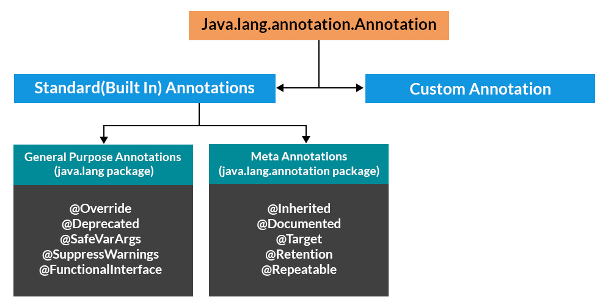

# Annotations
---

## What is Annotation?
- It is kind of META DATA to the java code.
- Its usage is optional.
- We can use this meta data information and add certain logic in our code if wanted.
- We can read this meta data information using **Reflection**.
- Annotations can be applied at anywhere like Classes, Methods, Interface, Fields, Parameters etc.
- Annotations are denoted using `@` e.g. `@Override`
- Annotations do not change the action of a compiled program.
- Annotations basically are used to provide additional information, so could be an alternative to XML and Java marker interfaces.

---

## Types of Annotations


## General Purpose Annotations in Java
General purpose annotations are built-in annotations provided by Java that can be used anywhere (class, method, variable, etc.) and are not tied to any specific framework.

1. `@Override`  
Indicates that a method is overriding a superclass method.

2. `@Deprecated`  
- Marks a class/method as outdated.
```java
@Deprecated
public void oldMethod() {
}
```
- Now compiler shows warning when used.
- Better Version of `@Deprecated` (Java 9+):
```java
@Deprecated(
    since = "1.2",
    forRemoval = true
)
```

3. `@SuppressWarnings`
- Suppresses compiler warnings.
```java
@SuppressWarnings("unchecked")
List list = new ArrayList();
```
- Common Warning Types:
 - "unchecked"
 - "deprecation"
 - "rawtypes"
 - "unused"

4. `@SafeVarargs` (Java 7+)  
Suppresses heap pollution warnings for varargs.
```java
@SafeVarargs
public final void print(List<String>... lists) {
}
```

5. `@FunctionalInterface` (Java 8+)  
Ensures interface has only one abstract method.

### What is Heap Pollution in Java?
- Heap pollution occurs when a variable of a parameterized type refers to an object that is not of that parameterized type.
- In simple words: Generics say one thing, but runtime object is something else.
- This happens because Generics use **type erasure** in Java.
```java
import java.util.*;

public class HeapPollutionExample {

    public static void main(String[] args) {

        List<String> list = new ArrayList<>();

        List rawList = list;   // ⚠ raw type assignment

        rawList.add(100);      // Adding Integer into List<String>

        String value = list.get(0);  // 💥 ClassCastException
    }
}
``` 
#### What Happened?
- `list` is declared as `List<String>`
- Assigned to raw type `List`
- Added `Integer`
- At runtime → JVM tries to cast Integer to String
- 💥 ClassCastException  
This is heap pollution.

#### How to Prevent Heap Pollution?
1. Avoid Raw Types
2. Use `@SafeVarargs`  
Use only when: Method is `final`, `static`, or `private`
3. Avoid Mixing `Arrays` & `Generics`
```java
List<String>[] array = new List<String>[10]; // ❌ Not allowed
```
---
## Annotations used over another annotations (META-ANNOTATIOn)
1. `@Target`
- Defines where an annotation can be applied.
```java
import java.lang.annotation.*;

@Target(ElementType.METHOD)
@interface MyAnnotation {}
```
- Now it can only be used on methods.
- Common `ElementType` Values  

| ElementType          | Usage                  |
| -------------------- | ---------------------- |
| `TYPE`               | Class, Interface, Enum |
| `METHOD`             | Methods                |
| `FIELD`              | Fields                 |
| `PARAMETER`          | Method parameters      |
| `CONSTRUCTOR`        | Constructors           |
| `ANNOTATION_TYPE`    | On other annotations   |
| `TYPE_USE` (Java 8+) | Anywhere type is used  |
- If `@Target` is not specified → annotation can be used anywhere.

2. `@Retention`
- Defines how long annotation is retained.
```java
@Retention(RetentionPolicy.RUNTIME)
```
- Retention Policies  

| Policy            | Available At                                       |
| ----------------- | -------------------------------------------------- |
| `SOURCE`          | Only in source code (discarded after compilation)  |
| `CLASS` (default) | Stored in .class file but not available at runtime |
| `RUNTIME`         | Available via reflection                           |

3. `@Documented`
- Includes annotation in Javadoc.
```java
@Documented
@interface MyAnnotation {}
```
- Without this → annotation won’t appear in generated docs.
- Mostly used in API-level annotations.


4. `@Inherited`
- Allows subclass to inherit annotation from parent.
```java
@Inherited
@Target(ElementType.TYPE)
@Retention(RetentionPolicy.RUNTIME)
@interface MyAnnotation {}
```
- Example:
```java
@MyAnnotation
class Parent {}

class Child extends Parent {}
```
Now:  
```java
Child.class.isAnnotationPresent(MyAnnotation.class)  // ✅ true (because of @Inherited)
```
- Works only on class-level annotations
- Does NOT work on methods or fields

5. `@Repeatable` (Java 8+)
- Allows same annotation multiple times.
- Without it:
```java
@Role("ADMIN")
@Role("USER")  // ❌ Not allowed normally
```
- With `@Repeatable`:
```java
@Repeatable(Roles.class)
@interface Role {
    String value();
}

@interface Roles {
    Role[] value();
}
```
Now:
```java
@Role("ADMIN")
@Role("USER")
class MyClass {}
```

6. `@Native`  
Indicates field is native constant.

### Full Custom Annotation Example
```java
import java.lang.annotation.*;

@Target(ElementType.METHOD)
@Retention(RetentionPolicy.RUNTIME)
@Documented
@interface ApiRequestValidate {
    String type();
}
```
What This Means:  
- Can be applied on methods
- Available at runtime
- Included in documentation

---
## User defined or Custom annotations
### Custom Annotation Creation (Step-by-Step)  
1. Define the Annotation
```java
import java.lang.annotation.*;

@Target({ElementType.PARAMETER})                // Where it can be used
@Retention(RetentionPolicy.RUNTIME)        // Available at runtime
@Documented
public @interface ApiRequestValidate {

    String type();                         // Required parameter

    boolean required() default true;       // Optional parameter with default
}
```
What’s Happening Here?
- `@Target` → Annotation can be applied on methods
- `@Retention(RUNTIME)` → Reflection can read it
- `String type()` → Required attribute
- `default` → Makes attribute optional

2. Use the Annotation
```java
@RestController
public class OrderController {

    @PostMapping("/orders")
    public String createOrder(@ApiRequestValidate(type = "CREATE_ORDER")
            @RequestBody OrderDto orderDto)) {
        return "Order Created";
    }
}
```

3. Read Parameter Annotation Using Reflection
```java
import java.lang.annotation.Annotation;
import java.lang.reflect.Method;
import java.lang.reflect.Parameter;

public class AnnotationReader {

    public static void main(String[] args) throws Exception {

        Class<?> clazz = OrderController.class;

        for (Method method : clazz.getDeclaredMethods()) {

            Parameter[] parameters = method.getParameters();

            for (Parameter parameter : parameters) {

                if (parameter.isAnnotationPresent(ApiRequestValidate.class)) {

                    ApiRequestValidate annotation =
                            parameter.getAnnotation(ApiRequestValidate.class);

                    System.out.println("Method: " + method.getName());
                    System.out.println("Parameter: " + parameter.getName());
                    System.out.println("Validation Type: " + annotation.type());
                }
            }
        }
    }
}
```

### Types of Custom Annotations
| Type         | Example                                        |
| ------------ | ---------------------------------------------- |
| Marker       | `@Override`                                    |
| Single-value | `@SuppressWarnings("unchecked")`               |
| Multi-value  | `@ApiRequestValidate(type="X", required=true)` |
